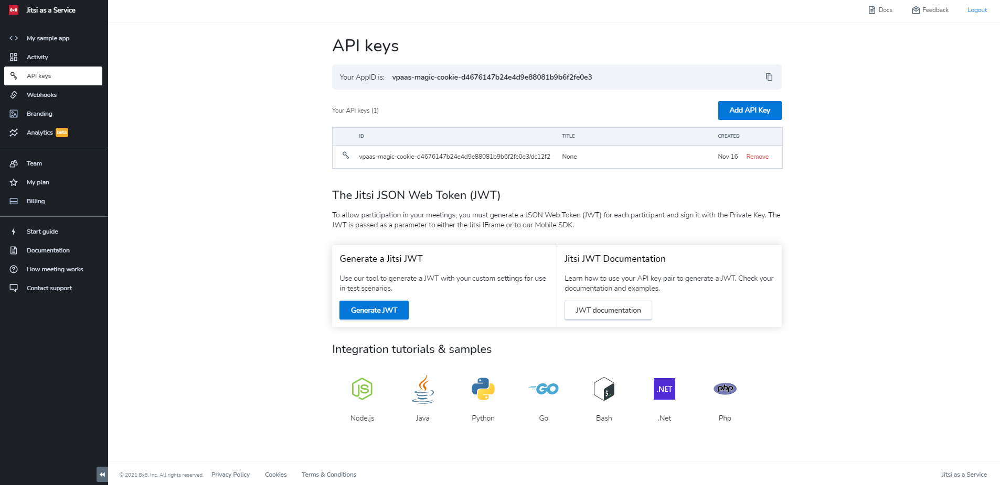
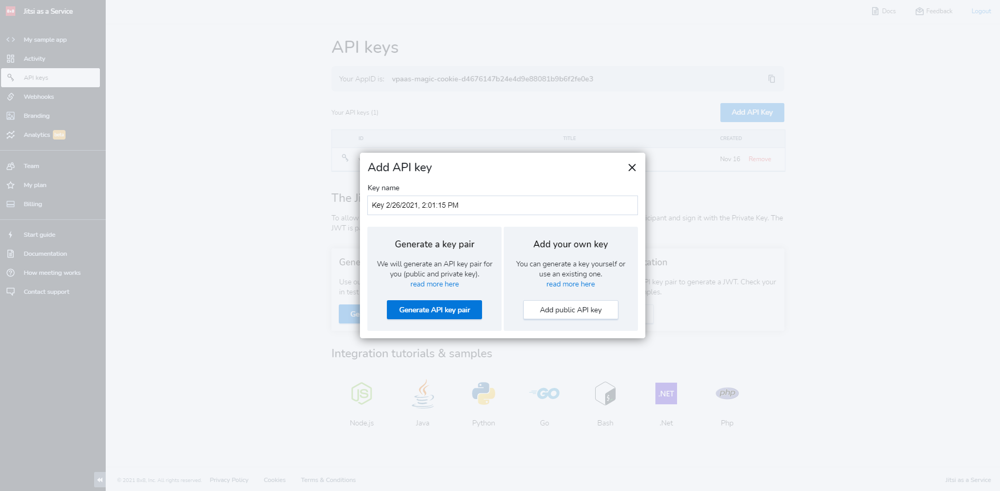
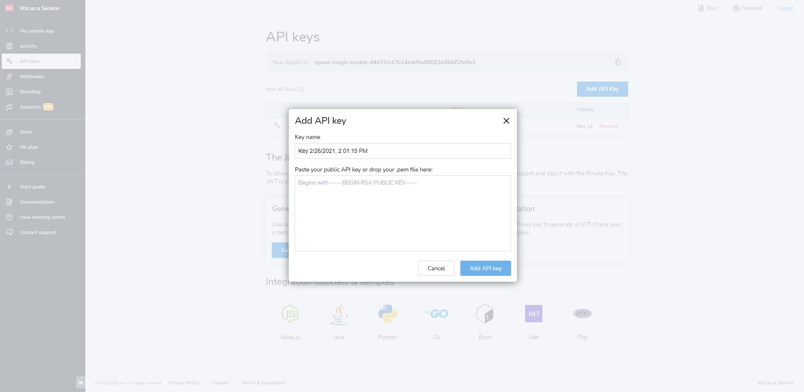
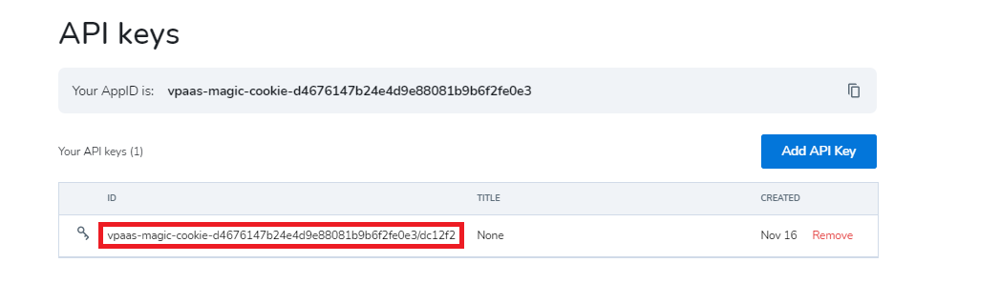
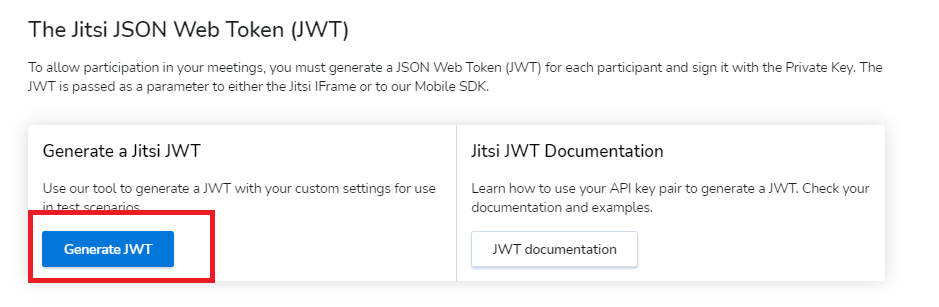

# API keys

The Developer Console **API Keys** page enables you to define and manage the authentication keys for your meeting participants. You add the API keys used to authenticate the Jitsi JSON Web Tokens (JWTs) created by your integration for each individual user endpoint.

To enable participation in your AppID meetings, you must generate a JWT for each participant and sign it with the Private Key.

## Uploading your API Key

You have two options to add a JaaS API Key, either we generate a key pair for you, or you can add your own key.

**NOTE**

We do not store the Private Key. In case you use an API Key generated by us, please make sure to download the Private Key before closing the key generation dialog, as you will not be able to retrieve it later.  
  
If you did not save the Private Key, you can delete the API Key from the Keys list and generate another.
If you choose to upload your own [generated](/jaas/docs/api-keys-generate-add#generating-your-jaas-api-key) RSA key, the Public Key can be dragged and dropped into the **Add API key** field. You can then add it by clicking the **Add API Key** button:

The API Key ID (kid) is composed of the AppID’s unique identifier and is used in the JWT header. The AppID unique identifier is prefixed as **`vpaas-magic-cookie-`** and is used as the value of the sub field in the JWT.

The following screenshot shows a kid example:

Refer to [***The Jitsi JWT***](/jaas/docs/api-keys-jwt) for more details.

## Generating a test JWT

Please use the `JWT Generator` under **Generate a Jitsi JWT** subsection in order to create short-lived JWT's to be used in testing/development.

