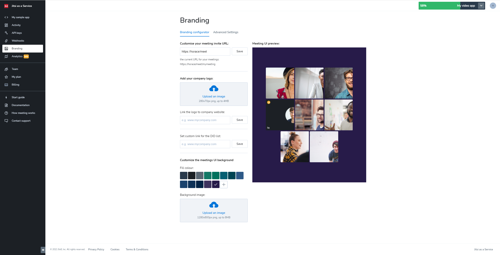
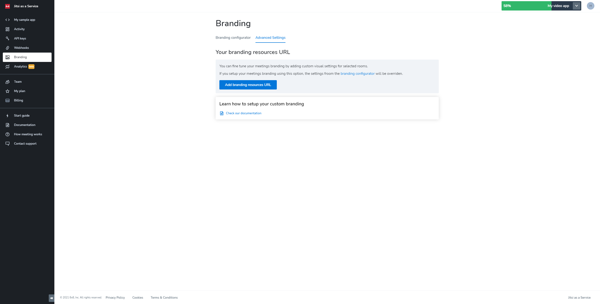

# Branding

The **Branding** page enables you to brand the meetings run on your AppID with your own:

* Custom meeting invite URL
* Enterprise Logo or symbol
* Company website link
* UI background image or color
* Custom DID list URL

Setting the custom meeting invite URL enables you to specify the URL that meeting participants receive when they want to share the meeting link with others.

Configuring and setting your enterprise logo or symbol enables you to have your brand displayed in meetings, recordings, and live streaming sessions from your AppID.  

Using a clickable link on your logo that leads to your company website also further facilitates and enhances your brand identity.

## Branding configurator

Branding configurator offers an interface for overwriting all the configurable UI elements on your meetings. The settings in branding configurator apply to all the meetings under your AppID.

## Advanced settings

Advanced branding settings allow you to configure your meetings UI on a per-room level. Setting advanced branding for your AppID will overwrite your **branding configurator** settings.

Please refer to the [Advanced Branding section](jaas-prefs-advanced-branding) for details on advanced branding and on how to set it up.

