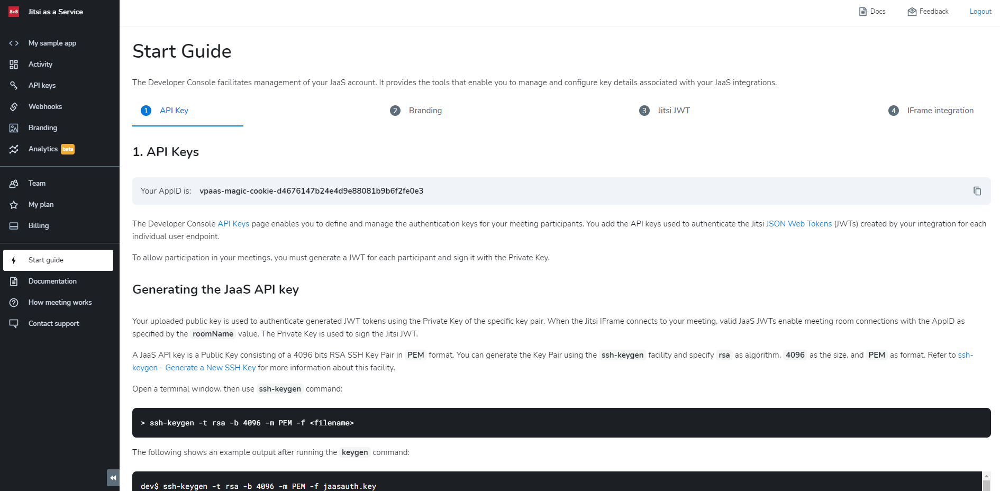

# Start guide

The **Start guide** page on the Developer Console provides you access is your go-to reference for quick, accessible information about your 8x8 JaaS integration. The guide provides information about JaaS topics such as:

* Core concepts
* Adding an API Key
* Customizing your JaaS integration using Branding
* Generating your first Jitsi JWT
* References to sample code you can use to start building out your integration

---
