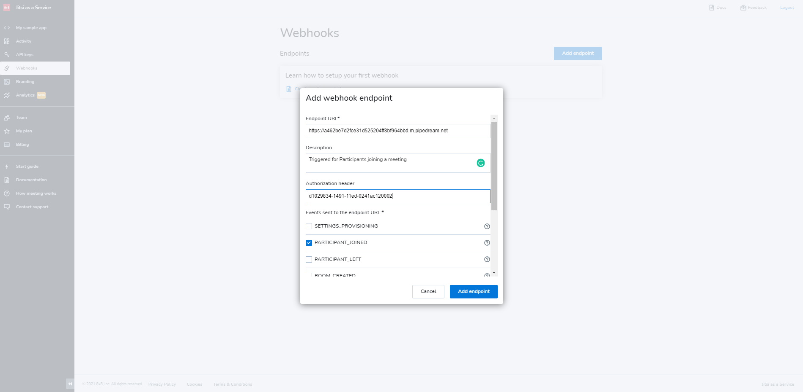
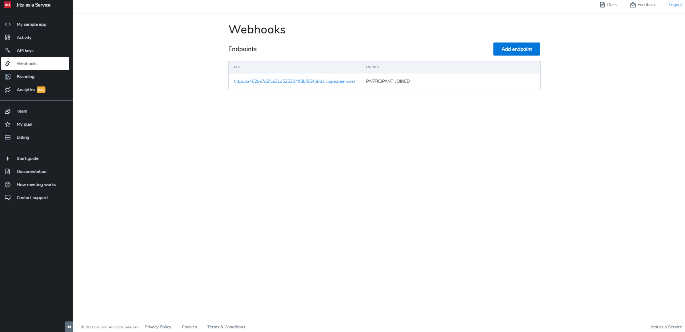

# Webhooks

The Developer Console **Webhooks** page enables you to define **`POST HTTP`** JaaS platform requests. These requests can be triggered by selected and defined in-meeting or post-meeting events that are generated by your AppID.

For additional information about webhooks refer to the [***Jitsi as a Service (JaaS) Webhooks Reference***](/jaas/docs/webhooks-overview).

## Defining a Webhook endpoint

You can define an endpoint by clicking **Add endpoint** and specifying a mandatory **target URL**. After you have added the webhook, you can select one or more events that trigger requests to the defined endpoint. The added endpoints are listed by URL and list of events.

You can optionally configure an **Authorization** header to be sent with each webhook request. This enables you to authorize incoming requests.

The following screenshot shows a ***PARTICIPANT_JOINED*** action event configuration with an endpoint URL of **`https://postb.in/b/1600147371176-9105843019206`**:

You can later edit the current endpoint by selecting it from the list, or add more endpoints for other significant meeting events.

The following screenshot shows the completed webhook configuration:

The webhook endpoint expects data through a POST request and confirms successful data receipt through the return of an **`2xx`** status code. If a successful status is not returned, follow up webhook delivery attempts are made with an exponential back off.

The same event might occasionally be delivered more than once which guards against duplicated events using the **`idempotencyKey`**.

Event ordering is not guaranteed; therefore, ***PARTICIPANT_JOINED*** might be received prior to ***ROOM_CREATED***.
