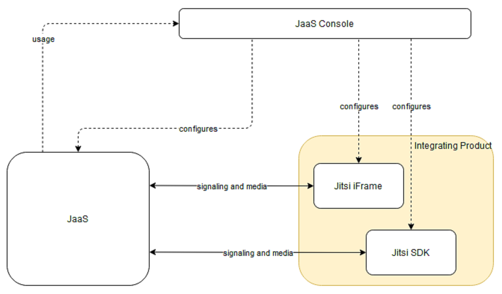

# Overview

Jitsi as a Service (JaaS) enables you to develop and integrate Jitsi Meetings functionality into your web applications. The JaaS integration incorporates the extensive functionality of the 8x8 Jitsi Platform so you can host meetings that leverage the distributed Meetings infrastructure from datacenters around the world.

As shown in the following diagram, the JaaS Developer Console enables you to configure and incorporate the powerful [IFrame](/jaas/docs/iframe-api-overview) and [Mobile SDK](/jaas/docs/mobile-sdk-overview) Jitsi components to further facilitate and enhance your meetings:

Your JaaS account provides an isolated context referred to as a tenant - this is where your meetings take place and where you create your meeting room. The tenant defines the root level for the meeting room namespaces you create and use. All JaaS Meeting rooms are prefixed with the tenant ID. Refer to [*Integrate JaaS using the Jitsi IFrame API*](iframe-api-overview) for more information.

⚠️ **IMPORTANT NOTE**

JaaS documentation will often refer to various [Jitsi Meet developer guide](https://jitsi.github.io/handbook/docs/dev-guide/dev-guide-start) subsections. It's important to note that JaaS meetings are hosted on **8x8.vc** domain, while the refered sections from the Jitsi Meet developer guide all mention **meet.jit.si** domain, which can be confusing. When using pieces of information from the **Jitsi Meet developer guide**, please always use **8x8.vc** instead of **meet.jit.si** as the domain value in your implementation, as **meet.jit.si** does not accommodate the JaaS infrastructure.  
  
**8x8.vc** is a special deployment of Jitsi infrastructure with support for JaaS and with a few more differences compared to the **meet.jit.si** deployment.
**To get started, go to the [8x8 Jitsi as a Service](https://jaas.8x8.vc) page and sign-up for a JaaS account.**
