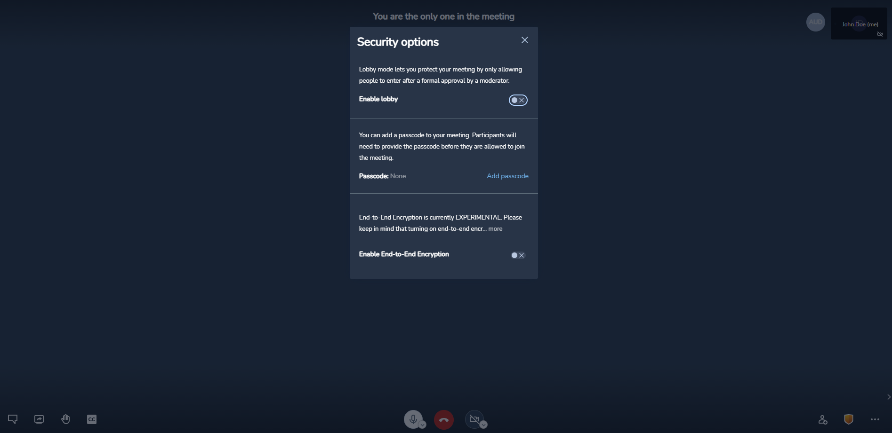

# Meeting security

A moderator has the option to secure a meeting either by adding a pincode or by enabling lobby, or both. Any new meeting participant will initially join the lobby page and he needs to ask for permission to join the meeting through a button on the UI. The moderator receives a notification with the user name and an option to either allow or disallow that user to join the ongoing meeting.

The pincode and the lobby features are controled from the shield icon on the meeting UI:

---
