# Livestreaming

## Overview

The livestreaming feature in JaaS allows users to broadcast their video conferences to a larger audience by streaming to platforms like YouTube or any other platform that accepts an RTMP stream.

## How to Livestream to YouTube

## Prerequisites

These are the requirements to start using livestreaming:

* Livestreaming is a paid add-on which **require a billing / payment method** to be added to your JaaS Account.
* The current user's **JWT** should enable **livestreaming** to be able to use the feature.

```json
 "features": {
      "livestreaming": true,
      "outbound-call": true,
      "sip-outbound-call": false,
      "transcription": true,
      "recording": true
    },

```
* If you plan to stream to YouTube, you will need a YouTube account in order to start a Livestream on YouTube to send the RTMP stream to. If you are planning to stream on another platform, ensure that it supports an RTMP stream and has a stream key.

## Demo Video

This is an accompany video guide which covers how to stream to YouTube using JaaS.

<iframe
  src="https://www.youtube.com/embed/XD15uvl_yp8?si=Tdo08IsohX04iCUB"
  height="500px"
  width="100%"
  allow="picture-in-picture; web-share"
  allowFullScreen>
</iframe>

## Livestream Menu

To access the livestream menu within a JaaS call, go to the **Triple Dot Menu** and navigate to **Start live stream** option.

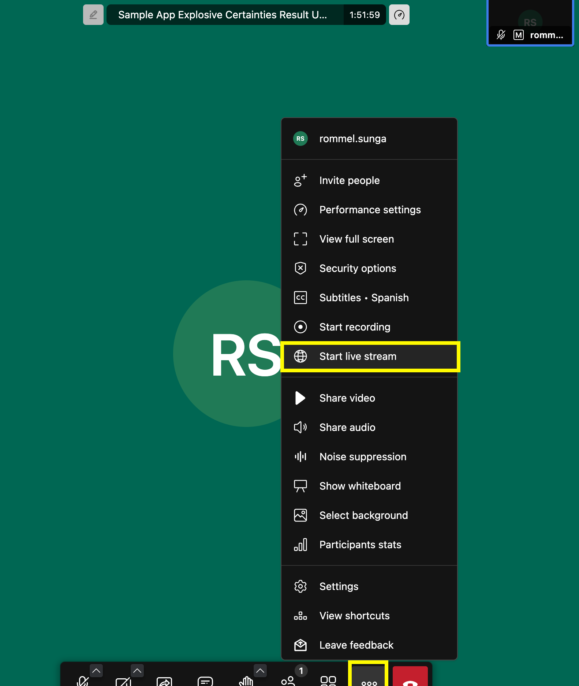
  

Once you open this menu item you should see this box. If you see the warning below, this is due to your YouTube/Google Account not having live streaming setup. You can either select a different account with live streaming set up or you can use the Live Stream Key covered in the section **Option 1) Streaming via Stream Key**.

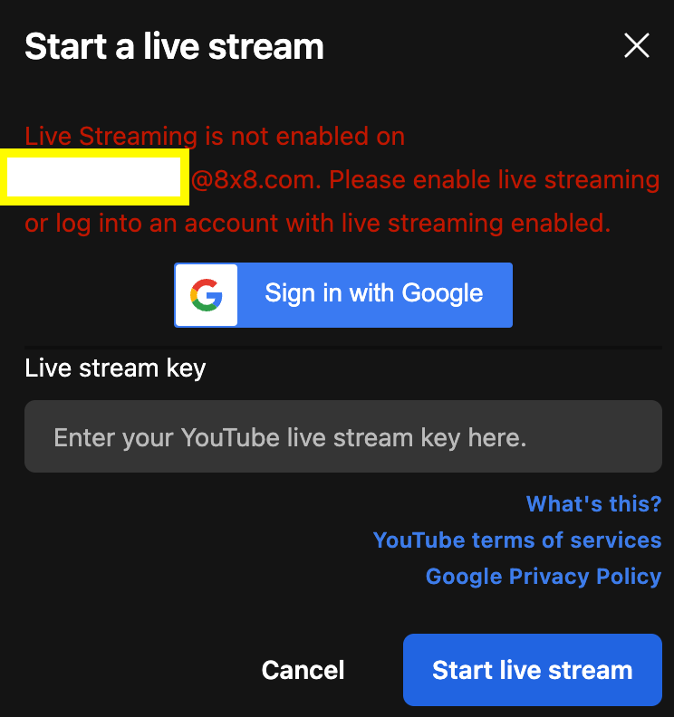
If you do have a Live stream setup you should see the box populated as below where it will allow you to select a live stream.

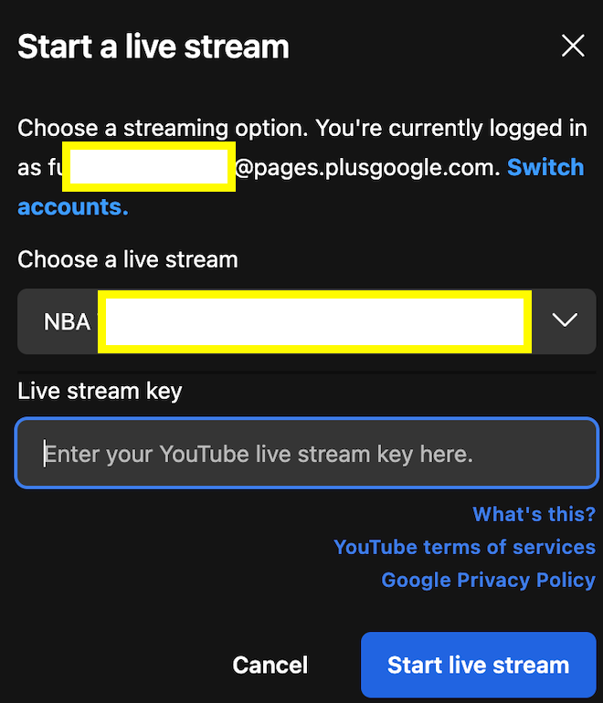
  

Regardless of whether you choose between a live stream or a Live stream key, the next sections will cover what you will need

## Streaming to YouTube

Once you are logged into your YouTube account, navigate to the **Create > Go Live** option.

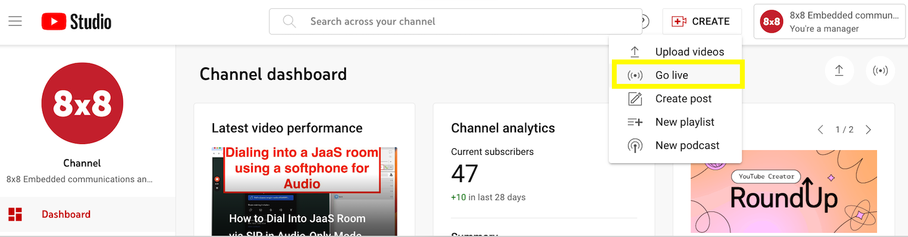

You can navigate to the **Stream** option to start a new stream immediately. Alternatively you can schedule a stream at a later date/time.

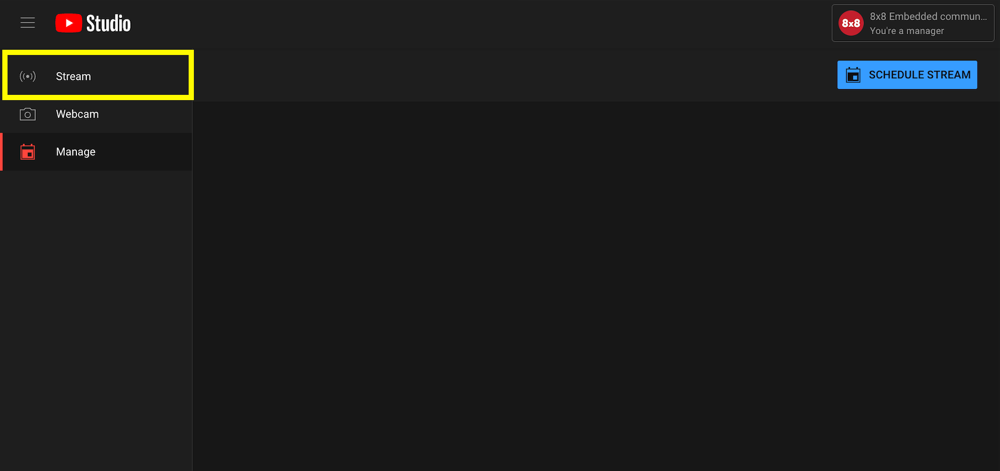

Regardless once it is time to start your stream, you should see the page below, select yout stream settings. Either **create a new stream key** or **select an existing stream key**. 

Ensure that you **copy your Stream Key** from this page.

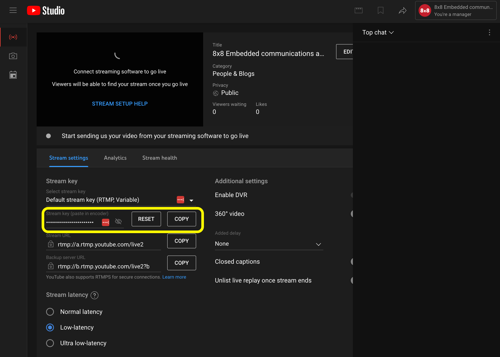
Once you obtain the stream key, paste it into the **Live stream key** text box and click **Start Live Stream**.

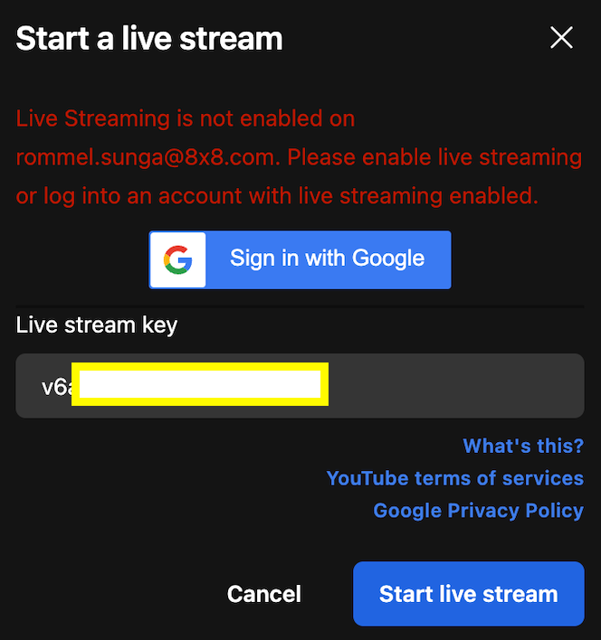
This should result in a few dialog boxes being shown confirming that the livestream and also a red globe indicator at the top of the JaaS Room indicating the livestream is active.

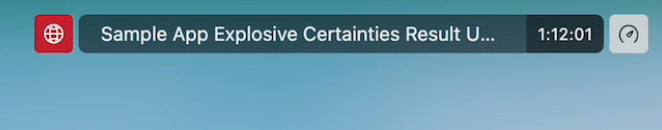
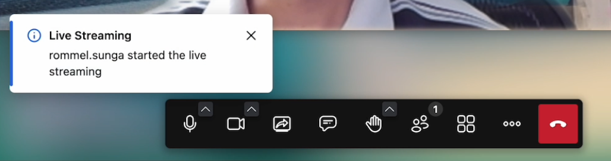

## Viewing the YouTube Livestream

From YouTube Studio when you are logged in as a YouTube Channel Owner / Manager you should be able to see a preview of the stream from the same page.

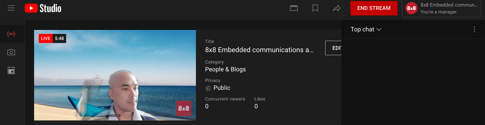

If your stream is public, this stream should be visible from your YouTube channel at this point for your regular YouTube viewers.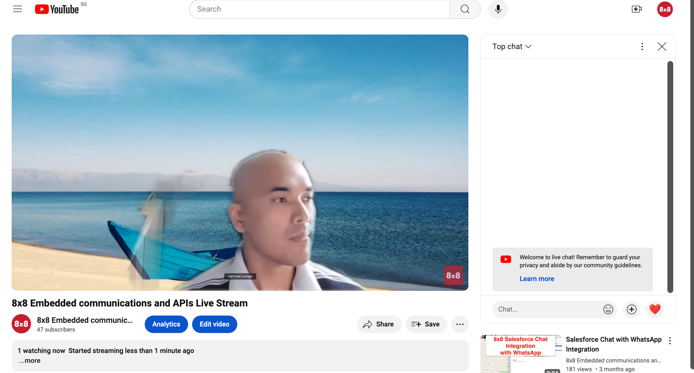

### Streaming to a Custom RTMP Endpoint (Twitch)

This section will cover how it is possible to stream to a custom RTMP endpoint by using Twitch as an example. 

## Prerequisites

These are the requirements to start using livestreaming:

* Livestreaming is a paid add-on which **require a billing / payment method** to be added to your JaaS Account.
* The current user's **JWT** should enable **livestreaming** to be able to use the feature.

```json
 "features": {
      "livestreaming": true,
      "outbound-call": true,
      "sip-outbound-call": false,
      "transcription": true,
      "recording": true
    },

```
* An **RTMP Endpoint**. If you plan to stream to Twitch you can follow the steps below to obtain your Twitch RTMP endpoint.

## Demo Video

This is an accompany video guide which covers how to stream to Twitch via RTMP.

<iframe
  src="https://www.youtube.com/embed/FwV4KP4H9Qc?si=-bTKRU5TLPjEn5Yr"
  height="500px"
  width="100%"
  allow="picture-in-picture; web-share"
  allowFullScreen>
</iframe>
## Livestream Menu

First access the livestreaming menu from **Triple Dot Menu > Start Live Stream**


## Input Livestream RTMP Endpoint

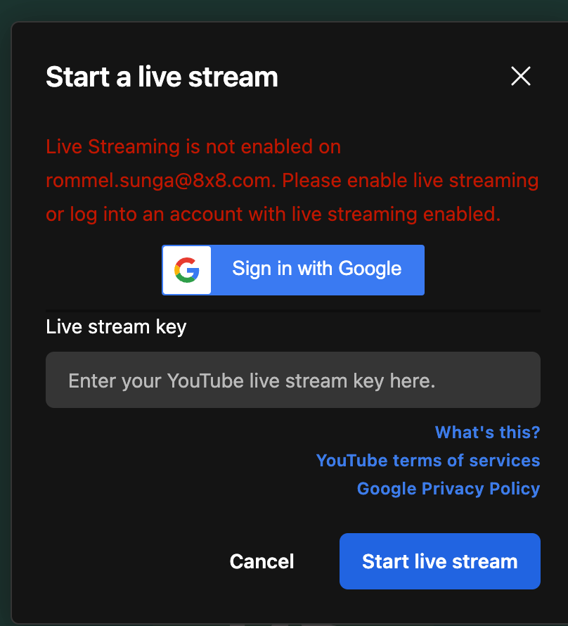
  

Now in the Live stream key, instead of a YouTube stream key as in the previous section, we will enter an **RTMP endpoint**. 

Since we are using Twitch as an example, you can obtain the RTMP endpoint by visiting their [page](https://help.twitch.tv/s/twitch-ingest-recommendation?language=en_US) to find out the RTMP endpoint closest to you for the best performance. It should follow a format similar to **rtmp://{region}.contribute.live-video.net/app/{stream_key}**

For **{region}** simply select the closest region on the page above. The **{stream_key}** can be obtained from Twitch under your **Creator Dashboard > Settings > Stream > Primary Stream Key**. 

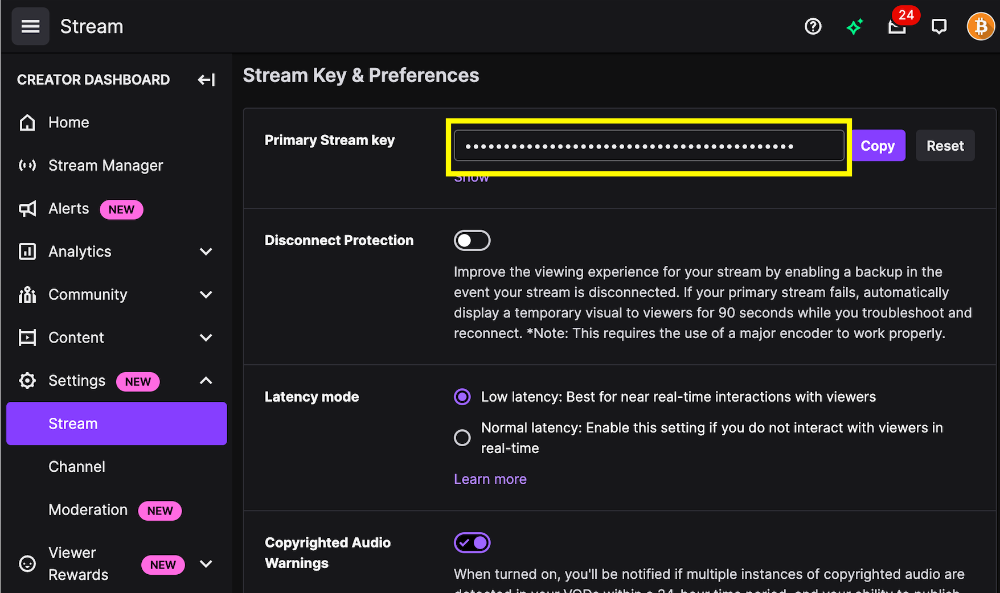

## Starting Livestream on Twitch

Once you have the full RTMP endpoint simply enter it into the **Live stream key** field and hit **Start live stream**to begin the stream.

> 📘 **Warnings**
> 
> There may be some warnings displayed regarding the **Live Stream key** which you can ignore. It should work with a valid RTMP endpoint provided.
> 
> 

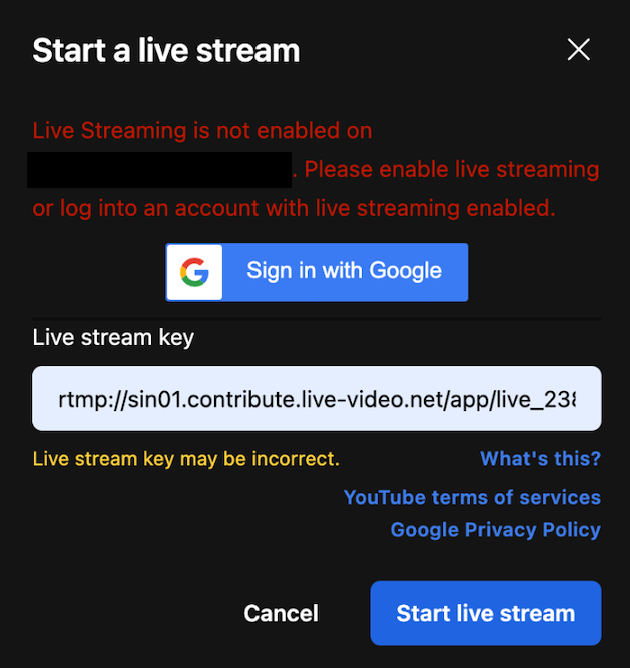
  

Afterwards your Livestream should be available on your Twitch page.


## Live streaming FAQ

| Question | Answer |
| --- | --- |
| How long does live streaming session last? | Live streaming does not automatically stop, however recording will stop automatically after 6 hours. |
| Am I limited to Twitch for RTMP? | You can send to any livestreaming service that supports RTMP ingest. |
| My Stream has a delay | There will be some stream delay between the JaaS Room and the YouTube Livestream which is part of the streaming process. If you are streaming to YouTube, you can choose different [streaming latency settings](https://support.google.com/youtube/answer/7444635?hl=en#zippy=%2Chow-to-change-live-stream-latency) on YouTube to help reduce this delay. Other live streaming platforms may also have an similar option. |
