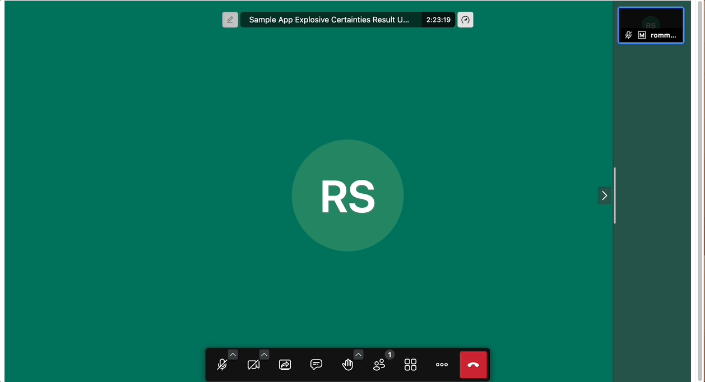
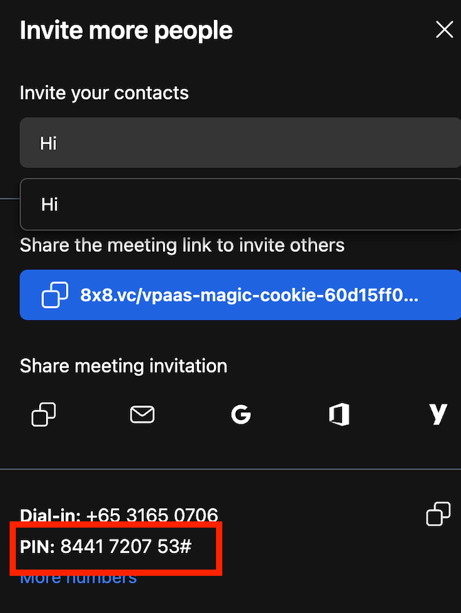
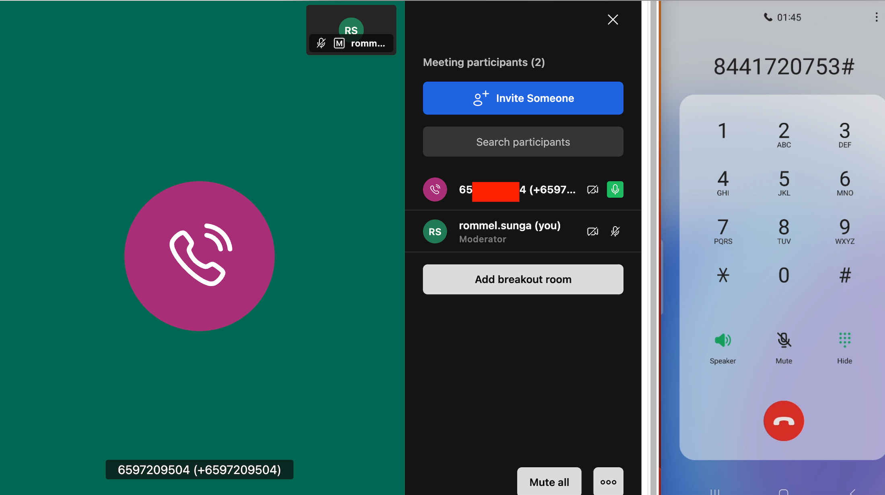
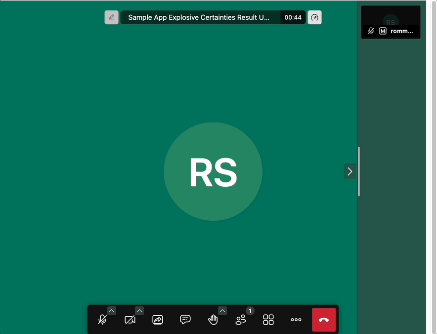

# PSTN Dial In/Out

## PSTN Dial In

Jaas has capabilities for joining meetings using PSTN/Telephony (Telephone Dialing) audio.

## Dial In from a JaaS Room

First enter a JaaS Room and then obtain a DID to call into. Open the **Triple Dot Menu > Invite People**, The DID for your detected country should be shown in the pop up box. If you need to obtain a different countries DID you can click **More Numbers**.


Note the **PIN Code** shared as well which will be used in the next step.


Share the **Dial-in Phone Number and PIN Code** to the person you would like to invite to the JaaS room. They should dial the DID and they will be asked to key in the PIN code for the meeting from the previous step.



Once they enter the PIN Code, they should be connected via Audio to the JaaS Room.

### API Usage

There may be cases when you wish to programmatically send out the PIN Code and DID List. The following two sections will take you through how to obtain these via API.

## Retrieving Meeting ID and PIN Code via API

You can get the meeting id using following API. Please replace **{Meeting-Name}** with the meeting you want to use. **{App-Id}** should be replaced with your Jaas app id.  

[https://8x8.vc/v1/_jaas/vmms-conference-mapper/v1/access?conference={Meeting-Name}@conference.{App-Id}.8x8.vc](https://8x8.vc/v1/_jaas/vmms-conference-mapper/v1/access?conference=%7BMeeting-Name%7D@conference.%7BApp-Id%7D.8x8.vc)

The API response will contain the following information.

```json
{
  "message": "Successfully retrieved conference mapping",
  "id": "1111111111111",
  "conference": "{Meeting-Name}@conference.{App-Id}.8x8.vc",
  "url": "https://8x8.vc/{App-Id}/{Meeting-Name}",
  "fqn": "{App-Id}/{Meeting-Name}",
  "name": "{Meeting-Name}",
  "tenant": "{App-Id}",
  "hasPasscode": false
}

```

The **id** from the response is the **meeting's pin code**. You can do this upfront so you can properly edit your invites.

## Retrieving DID List via API

The list of DID can be fetched using this API: [[https://8x8.vc/v1/_jaas/vmms-conference-mapper/access/v1/dids](https://8x8.vc/v1/_jaas/vmms-conference-mapper/access/v1/dids)](<https://8x8.vc/v1/_jaas/vmms-conference-mapper/access/v1/dids>) We recommend using the API for fetching the DID for each invite, because we sometimes add new numbers in new countries.

The API response will be a list of DIDs which can be shared to the person that should dial in.

```json
[
  {
    "countryCode": "US",
    "tollFree": false,
    "formattedNumber": "+1 456-221-4739"
  },
  ....
]

```

### PSTN Dial Out

JaaS will also allow you to dial a phone number directly from a JaaS room to invite them to join in audio-only mode.

## Prerequisites

There are a few prerequisites before using this feature:

* JaaS Account with a billing method added (to access Paid/Premium Features).
* Ensure that the [JWT](/jaas/docs/api-keys-jwt) that you generate for your user contains the user permissions for **outbound-call**. Below is a snippet of the features with outbound call enabled.

```
{
  ...
  "context": {
    "features": {
      "livestreaming": true,
      "outbound-call": true,
      "sip-outbound-call": true,
      "transcription": true,
      "recording": true
    },
    ...
}

```

* Add this line of code to your configuration to enable SIP Dial Out:

```javascript
interfaceConfigOverwrite: {
  ENABLE_DIAL_OUT: true
},

```

## Dial Out from a JaaS Room

Simply enter a JaaS room and navigate to the **Triple Dot Menu > Invite People**

Afterwards enter the number that you would like to dial in the **Invite your Contacts** box.


This should dial the number and when the callee picks up, they will be added in audio-only mode to the JaaS Room.

### Billing / Usage

In order to see the usage and charges associated with PSTN Dial In and Out in the JaaS Dashboard, please see:

* [Billing](/jaas/docs/jaas-console-billing) Section to determine the usage and charges in past months.
* [Activity](/jaas/docs/jaas-console-activity) Section to determine the current months usage.
