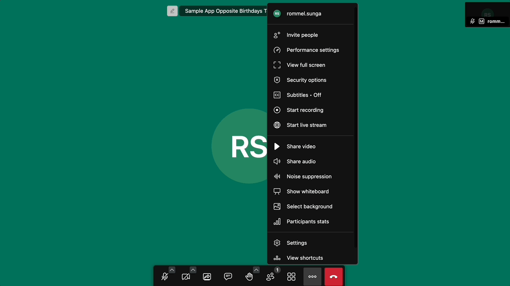
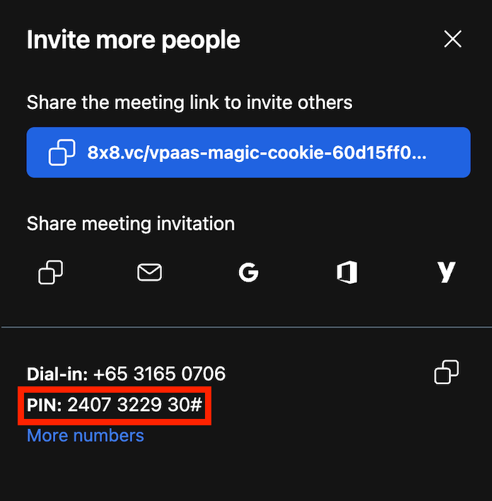
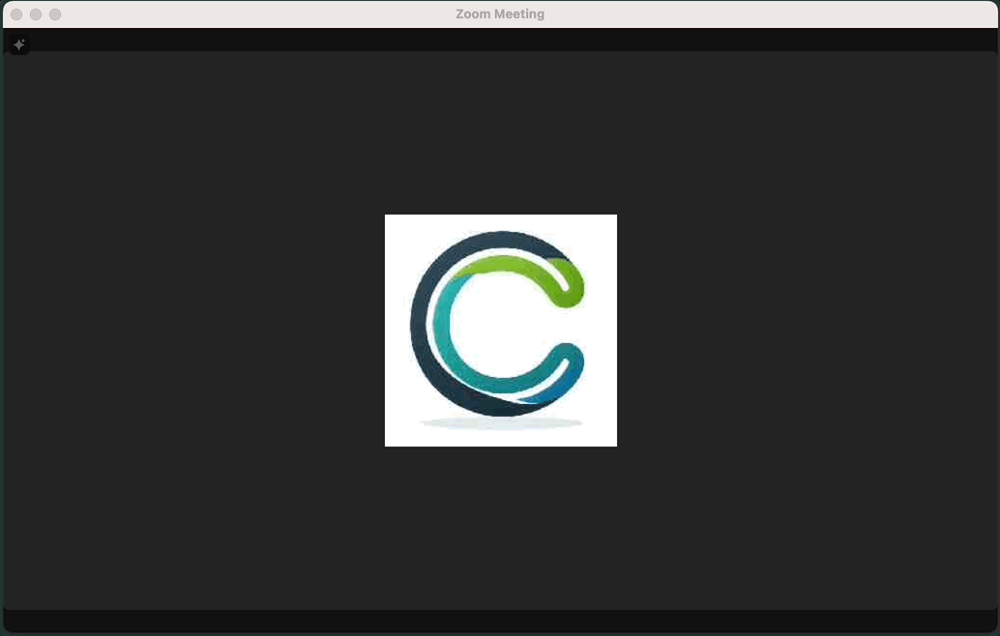
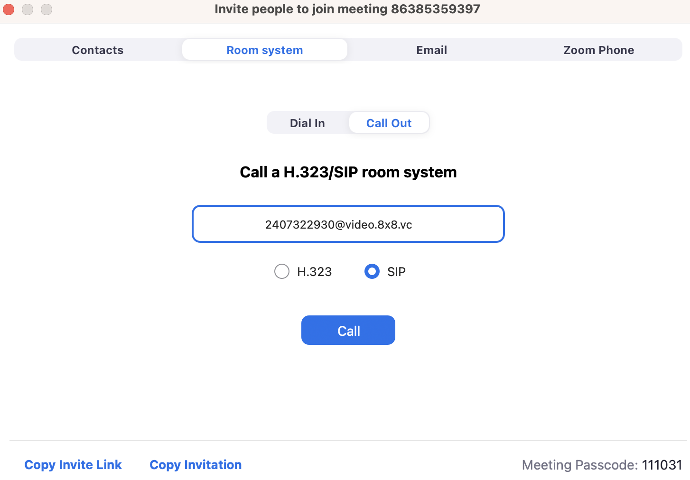
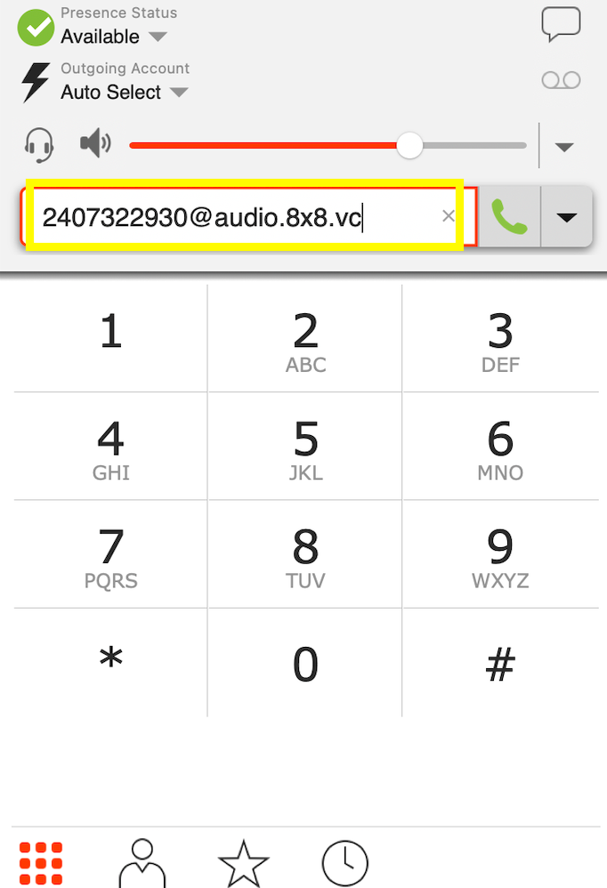
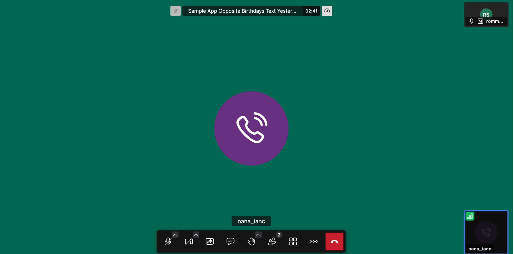
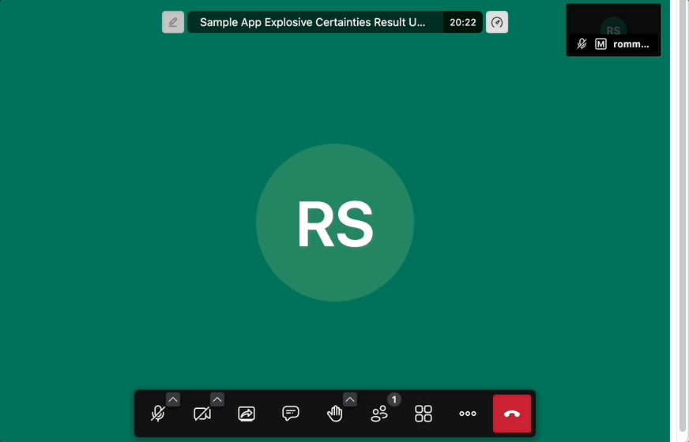
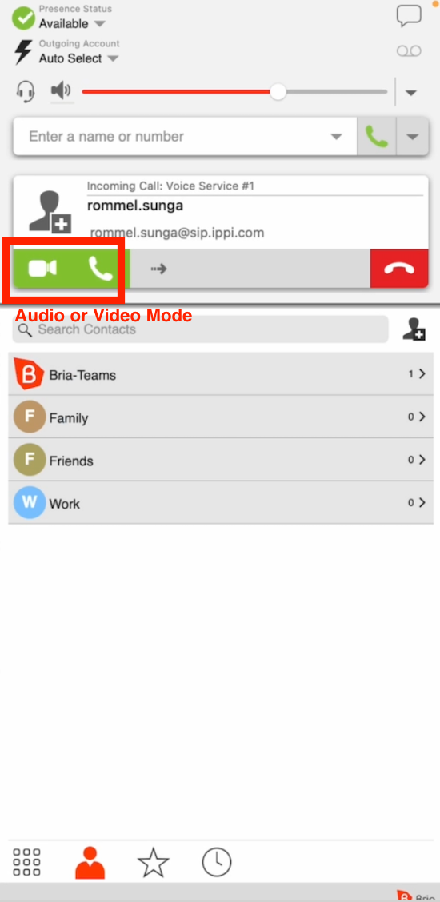
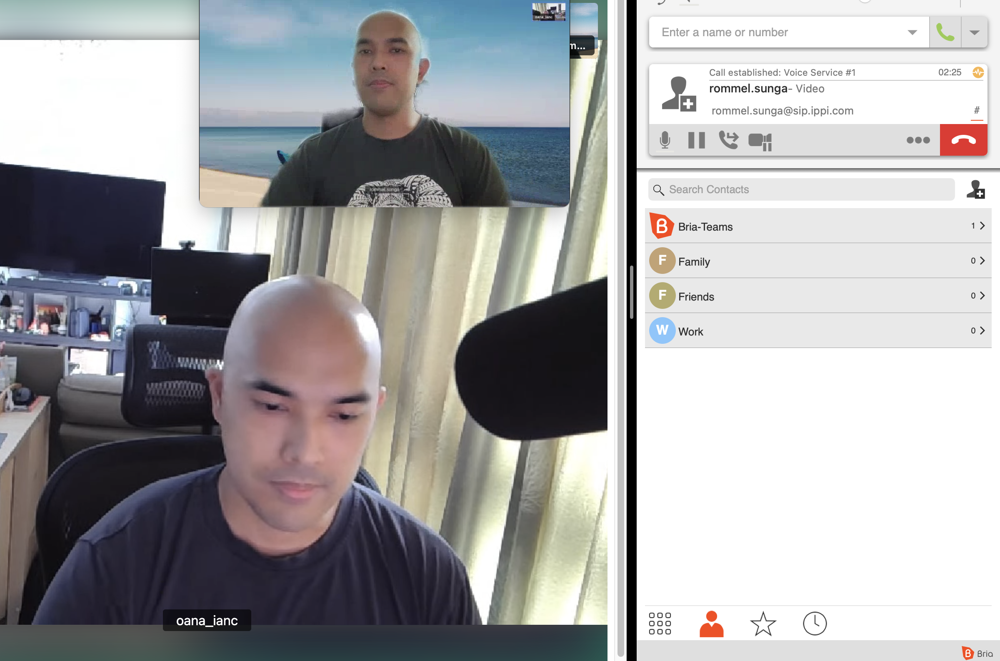
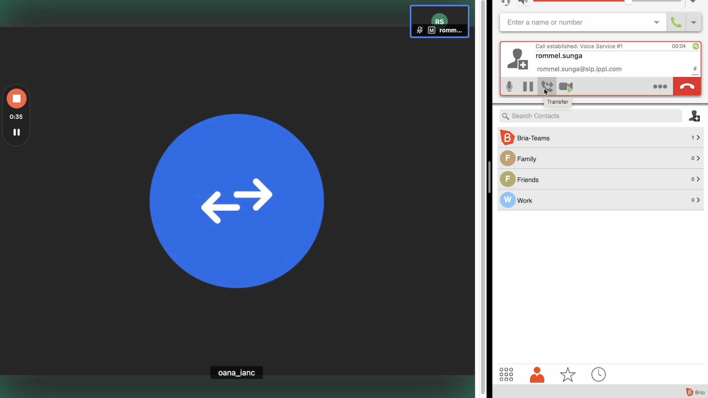

# SIP Dial In/Out

## Introduction

JaaS **SIP Dial In/Out** feature allows users to connect with participants on traditional phone networks, extending the flexibility and reach of Jitsi conferences. This feature is particularly useful for hybrid meetings involving both online and phone participants.

## SIP Dial In

This section covers how to use a SIP device to connect to a JaaS call through SIP. We use Zoom as an example of a typical SIP Device.

### Prerequisites

- JaaS Account with a billing method added (to access Paid/Premium Features).
- A SIP Device (Zoom is used as the example in this section of the tutorial)
  - Note for Zoom, the host account that creates the Zoom room will need access to the [H.323 or SIP Room Connector](https://support.zoom.com/hc/en/article?id=zm_kb&sysparm_article=KB0063510) paid add-on.
- Ensure that the [JWT](/jaas/docs/api-keys-jwt) that you generate for your user contains the user permissions for **sip-outbound-call**. Below is a snippet of the features with SIP outbound call enabled.

  ```javascript
  {
    ...
    "context": {
      "features": {
        "livestreaming": true,
        "outbound-call": true,
        "sip-outbound-call": true,
        "transcription": true,
        "recording": true
      },
      ...
  }
  ```

### SIP Dial In - Video Call

#### Video Walkthrough

This video will take you through a walkthrough of this section.

<iframe
  src="https://www.youtube.com/embed/25stELz48So?si=sudYwv5pYPbDkFCb"
  height="500px"
  width="100%"
  allow="picture-in-picture; web-share"
  allowFullScreen>
</iframe>

#### JaaS Room and PIN

Create or Join a JaaS Room. Afterwards obtain the PIN from the **Triple Dot > Invite People Menu**.

This GIF shows the process to obtain the PIN Code

The PIN should be available from the popup below.


Note down the PIN for this room which will be used when connecting through Zoom in the next step.

#### Connecting Through Zoom

Start your Zoom Client and join a meeting room. Navigate to **Participants > Invite > Room System > Call Out** as shown below.

> 📘 Room System not Showing?
>
> If you do not have the Room System option then the Zoom host may not have [H.323 or SIP Room Connector](https://support.zoom.com/hc/en/article?id=zm_kb&sysparm_article=KB0063510) paid add-on.
>

This GIF shows how to access the menu to call a SIP Room System.

Enter the following into the IP address or URI field above based on the PIN Code you noted down early.

For a combined **audio and video**experience: [pinCode@video.8x8.vc](mailto:pinCode@video.8x8.vc)  
For **audio** only: [pinCode@audio.8x8.vc](mailto:pinCode@audio.8x8.vc)

For our example above it should be the following value, however you should substitute the PIN Code for your room.  
[2407322930@video.8x8.vc](mailto:2407322930@video.8x8.vc)



After inputting the PIN Code, hit the **Call** button. You should see the SIP call connect successfully and then a participant named **VIMS** join the Zoom Room. Admit the participant in the Zoom Room.

On the JaaS Room you should see a participant named **Zoom#########** join the room. Both participants should have Video and Audio enabled.

> 📘 Zoom Popup
>
> Our Test Zoom environment has AI Companion on which generates a popup for the first few seconds after joining the room. This pop-up disappears after a few seconds.
>

This GIF shows the remaining process to connect through Zoom via SIP

After completing these steps, congratulations you have now successfully connected Zoom to JaaS via SIP with video/audio enabled.

### SIP Dial In - Audio Call

This section outlines how to make a call via a softphone such as Bria to a JaaS room for an audio only call.

#### Video Walkthrough

This video will take you through the steps mentioned in this section to connect a softphone to a JaaS room.

<iframe
  src="https://www.youtube.com/embed/JiLDsnUm2a4?si=uSxBDsi0zUUdcq0e"
  height="500px"
  width="100%"
  allow="picture-in-picture; web-share"
  allowFullScreen>
</iframe>

#### JaaS PIN Code

The first step is to obtain the **PIN Code** from the JaaS Room


The **PIN Code** will be available from the "Invite more people" popup.


Dial in to the JaaS room using Bria with the SIP address [pinCode@audio.8x8.vc](mailto:pinCode@audio.8x8.vc) where pinCode is replaced by your JaaS Room's pin code.

In our example above the SIP address is [2407322930@audio.8x8.vc](mailto:2407322930@audio.8x8.vc), however your PIN Code will be different.





## SIP Dial Out

From the JaaS room, it is possible to dial out to a SIP Address such as a softphone to invite them to join the room.

### Prerequisites

There are a few prerequisites before using this feature:

- JaaS Account with a billing method added (to access Paid/Premium Features).
- A SIP Softphone to receive the call (Bria is used in the tutorial).
- Ensure that the [JWT](/jaas/docs/api-keys-jwt) that you generate for your user contains the user permissions for **sip-outbound-call**. Below is a snippet of the features with SIP outbound call enabled.

  ```json
  {
    ...
    "context": {
      "features": {
        "livestreaming": true,
        "outbound-call": true,
        "sip-outbound-call": true,
        "transcription": true,
        "recording": true
      },
      ...
  }
      
  ```

- Add this line of code to your configuration to enable SIP Dial Out:

```javascript
interfaceConfigOverwrite: {
  ENABLE_DIAL_OUT: true
},
```

### Making a Call

After the required setup, go to your JaaS meeting and then open **Triple Dot Menu > Invite People**. In the dialog box that opens, proceed to enter the SIP address in the **Invite your contacts** box. This should result in a dialog box showing that you have invited that SIP address.


The softphone connected to that SIP Address should ring as shown, when you pick up the call you will be connected to the JaaS Room. The softphone can choose to connect to the call over **audio-only** or **video+audio**.



### Connected Call - Video Mode

If the call is connected through video, both the softphone participant and the JaaS participant can see each other on their respective screens.



### Connected Call - Audio-Only Mode

If the call is connected via audio-only, then an audio-only participant will join the JaaS room to represent the softphone. Both the JaaS participant and the softphone participant will be able to hear and speak to each other.



### Video Walkthrough

#### Video Call

This Video will show how it is possible to call from a JaaS (Jitsi as a Service) Room out to a softphone in Video Mode.

<iframe
  src="https://www.youtube.com/embed/IM59n3vD_-Y?si=2TuxSDWcCIFiD93t"
  height="500px"
  width="100%"
  allow="picture-in-picture; web-share"
  allowFullScreen>
</iframe>

#### Audio Call

This Video will show how it is possible to call from a JaaS (Jitsi as a Service) Room out to a softphone in Audio-Only Mode.

<iframe
  src="https://www.youtube.com/embed/XWayZ_BNP9Q?si=wTdinAUui-liCzW2"
  height="500px"
  width="100%"
  allow="picture-in-picture; web-share"
  allowFullScreen>
</iframe>
  
## Billing / Usage

In order to see the usage and charges associated with SIP Dial In and Out in the JaaS Dashboard, please see:

- [Billing](/jaas/docs/jaas-console-billing) Section to determine the usage and charges in past months.
- [Activity](/jaas/docs/jaas-console-activity) Section to determine the current months usage.
