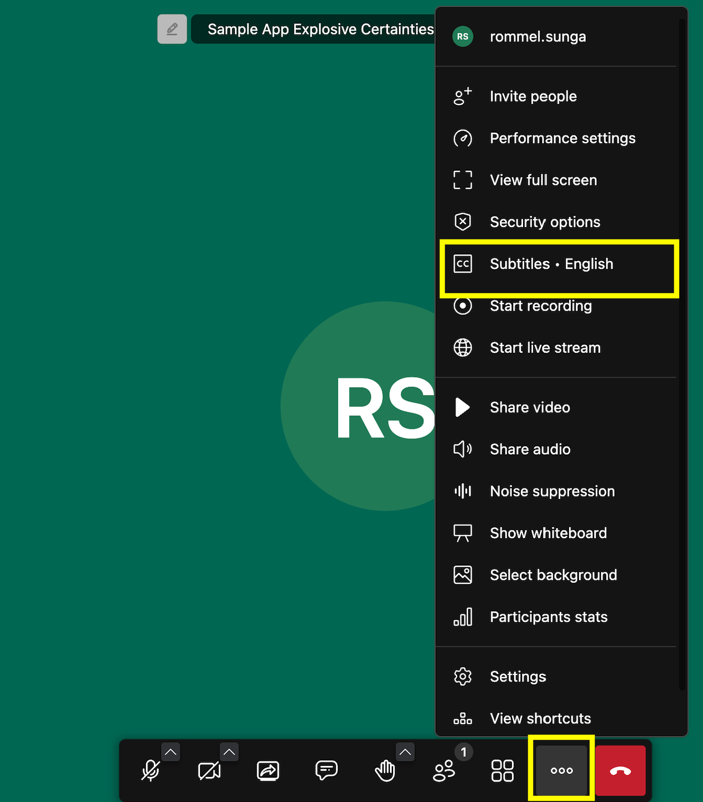
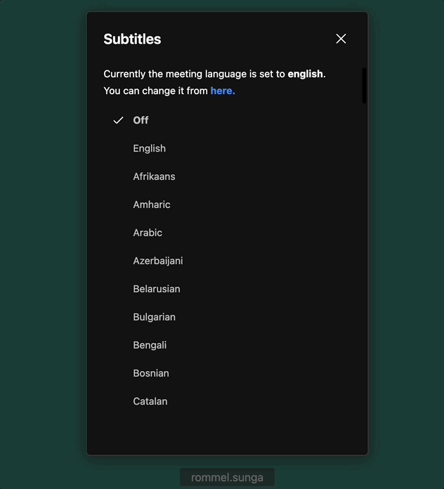
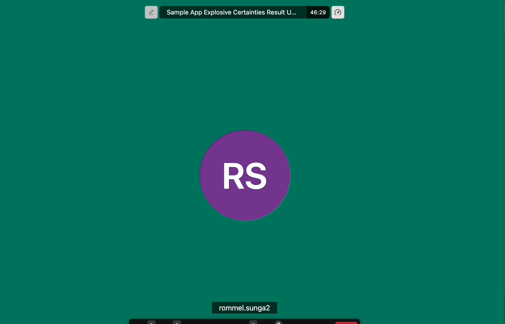
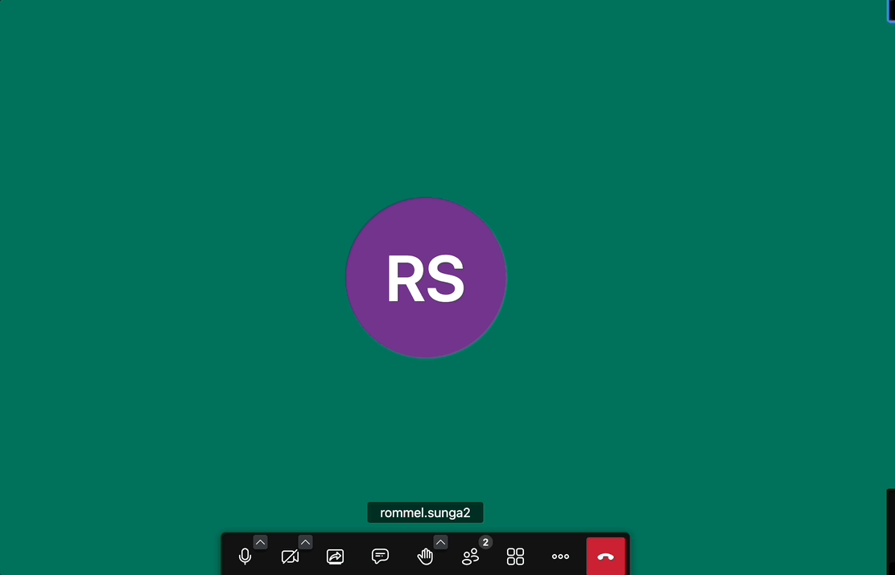

# Transcription and Translation

## Overview

This documentation outlines the transcription and translation capabilities provided by JaaS. These features are designed to enhance the functionality of video conferencing by converting spoken language into text and translating this text into various languages in real-time.

## Prerequisites

These are the requirements to start using these features:

* Transcription and Translation are paid add-ons which **require a billing / payment method** to be added to your JaaS Account.
* The current user's **JWT** should enable **transcription** to be able to use the feature. This will enable both transcription and translation. 

```json
 "features": {
      "livestreaming": true,
      "outbound-call": true,
      "sip-outbound-call": false,
      "transcription": true,
      "recording": true
    },

```

## Video Demo

This is a companion video demo of transcription and translation.

  

[iframe](https://www.youtube.com/embed/dhNjDrNcB-U?si=w3WN43sTjQY_y9yv "youtube.com")
## Using Transcription / Translation

In order to use the Transcription feature, navigate to the **Triple Dot Menu / More Options Button** then the **Subtitles** option within that menu. This only turns on translation for the current user. Other users will have to enable subtitles through the same process. Whenever any participant speaks in the room, a subtitle will appear at the bottom for the users who have enabled the feature.


By default the transcription will be in the same language as your interface, however you can choose to change it to a different language within the same **Subtitles** menu.


In order to use a different language you can change the language in the subtitle's menu.


Here is an example where a user is speaking in English and their words are automatically translated to Spanish which is the language set in the **subtitle** menu.


