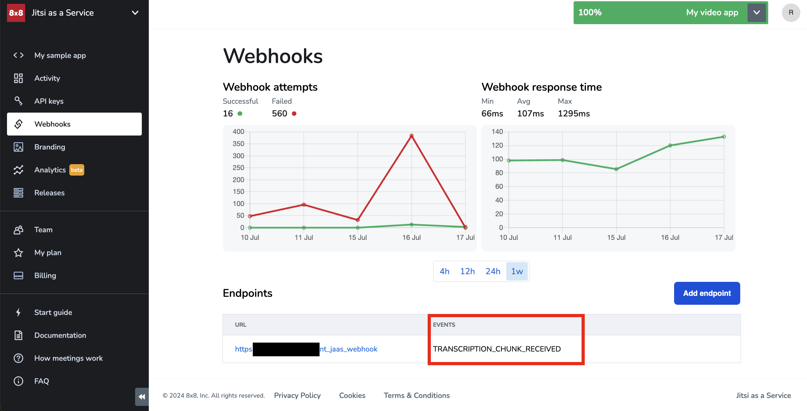
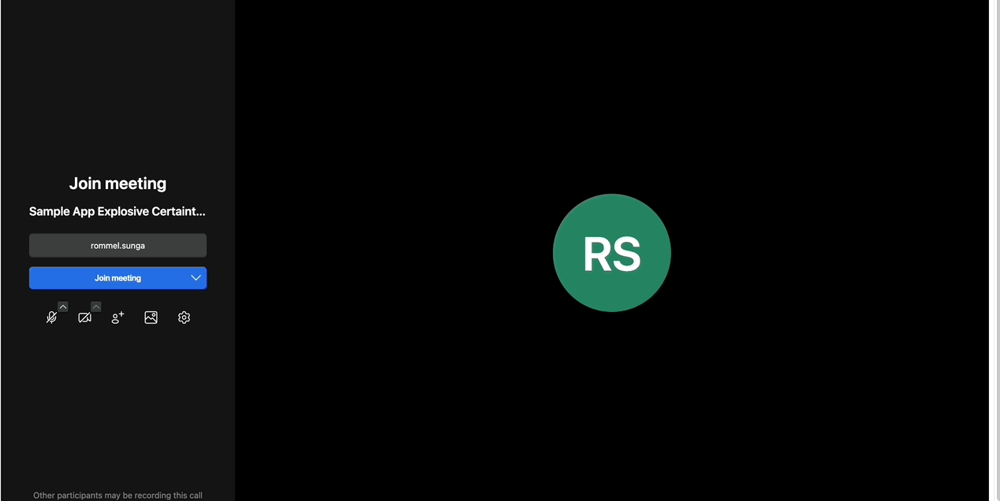
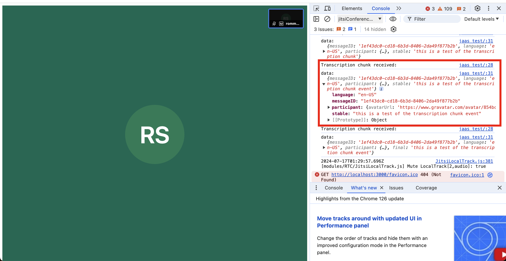
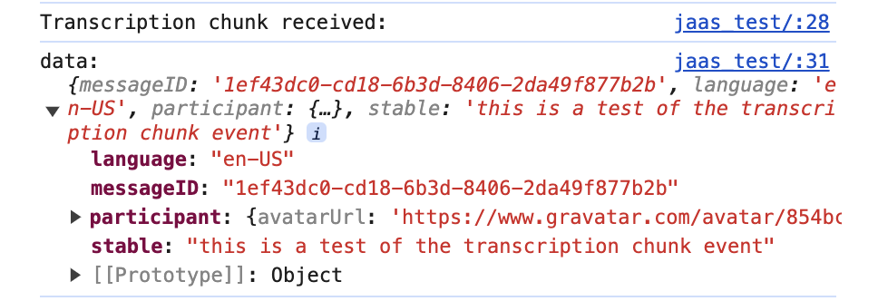

# Tutorial: Using Transcription Chunks

## Overview

When transcription is enabled in a room, JaaS has both **[Iframe event](https://jitsi.github.io/handbook/docs/dev-guide/dev-guide-iframe-events/#transcriptionchunkreceived)** and **[webhooks](/jaas/docs/webhooks-payload#transcription_chunk_received)** to inform you of any new transcription events (called chunks) in real time. This allows you to be informed of what is being said in a room and react to it in your program. Some possibilities could be to display the transcribed messages in your own interface or even trigger a chatbot in response to what is transcribed.

This tutorial will show you how to use both the Iframe events and webhooks to retrieve transcription chunk events so that your application can use them in real time.

## Requirements

* JaaS account with a billing method added. This is for enabling the transcription feature which is a paid feature.
* Ability to expose an endpoint to the public internet for JaaS to send a webhook.
* Basic knowledge in JavaScript and HTML to use the sample code provided.

## Example Code

The code will contain the following parts:

* Backend Server written in NodeJS
* Webpage written in HTML and JavaScript, using the JaaS Iframe as a base.

## Setup

First create a new directory somewhere on your computer for the sample code. 

```bash
mkdir jaas_transcription_app

```

Afterwards, prepare a new NodeJS app in the directory and then install express which is the only node dependency required with the following commands

```bash
npm init -y

npm install express

```

For the webhook component of this demo, you will need to expose an endpoint to the internet. You can use any method available, we use ngrok in this example as we are running locally.

Once you have a endpoint, you can set it up in the [webhook](jaas-console-webhooks) section of the JaaS Console. Ensure your webhook subscribes to the TRANSCRIPTION_CHUNK_RECEIVED event.



## Backend Code

The backend component will both serve the web page and also serve as an endpoint to send the jaas webhook to.

server.js
```
const express = require('express');
const path = require('path');

const app = express();
const port = 3000;

// Middleware to parse JSON bodies
app.use(express.json());

// Serve static files from the public directory
app.use('/jaas_test', express.static(path.join(__dirname, 'public')));

// Endpoint to print the body of the received API request
app.post('/print_jaas_webhook', (req, res) => {
    console.log('Received /print_jaas_webhook request');
    console.log('Request body:', req.body);
    res.send('Webhook received');
});

app.listen(port, () => {
    console.log(`Server is running on http://localhost:${port}/jaas_test`);
});

```

## Frontend Code

Our frontend uses the JaaS Iframe from the [sample](jaas-console-my-sample-app) app that you can get from your [JaaS console](https://jaas.8x8.vc/#/) with a few modifications. Create a new **public** directory and place this **index.html** file inside of it.

Ensure to replace the **JWT**, **magic cookie** and **room name** in the HTML below with unique value from your sample app from the JaaS console. You will need to generate a JWT for the user from your application w/ transcription. If you do not have a backend server already setup, you can generate a JWT from the JaaS Console's [API Keys section](https://jaas.8x8.vc/#/apikeys).

> 📘 **Transcription Feature**
> 
> Transcription is a **premium** feature so you will need to add a payment method to your JaaS account to enable it.
> 
> 

public/index.html
```html
<!DOCTYPE html>
<html>

<head>
  <script src='https://8x8.vc/<your magic cookie id>/external_api.js' async></script>
  <style>
    html,
    body,
    #jaas-container {
      height: 100%;
    }
  </style>
  <script type="text/javascript">
    window.onload = () => {
      const api = new JitsiMeetExternalAPI("8x8.vc", {
        roomName: "<your magic cookie id>/<room name>",
        parentNode: document.querySelector('#jaas-container'),
        interfaceConfigOverwrite: {
          ENABLE_DIAL_OUT: true
        },
        // Make sure to include a JWT if you intend to record,
        // make outbound calls or use any other premium features!
        jwt: "<Generate a JWT with transcription permissions>"
      }
      );
      api.addListener('transcriptionChunkReceived', event => {
        console.log("Transcription chunk received:");
        for (let key in event) {
          if (event.hasOwnProperty(key)) {
            console.log(`${key}:`, event[key]);
          }
        }
      });
  </script>
</head>

<body>
  <div id="jaas-container" />
</body>

</html>

```

## Running Sample App

You should now be able to run the nodejs server which by default runs on port 3000. The port number can be modified if needed.

```
node server.js

```

You should see the following output

```
Server is running on http://localhost:3000/jaas_test

```

Now go to the URL printed above and join the JaaS room. **Unmute** and enable transcription by selecting the **Subtitles** menu item from the menu bar. Now the transcription should be displayed below when you speak.



## Receiving Iframe Events

As you speak into the microphone, you should be able to see logs printed out in the console of your browser.


Here is a close up of the transcription event. You should see a property called **stable** which will contain the text of the transcription chunk event.



## Receiving Webhook Events

Similarly for the webhook, as you speak into the microphone, you should see some webhooks sent to your server in real time. Here's an example of such a webhook below.

```json
{
  eventType: 'TRANSCRIPTION_CHUNK_RECEIVED',
  sessionId: '8bfa0d8e-acb8-4cec-aecb-093109f7f90f',
  timestamp: 1721116353227,
  fqn: '<your app id>/<your room name>',
  idempotencyKey: '6c2f5fb5-26d9-4e31-b5c5-bba40ca5b063',
  customerId: '60d15ff098c04d71aa5fe31e06bf866e',
  appId: '<your app id>',
  data: {
    language: 'en-US',
    final: 'this is a test of transcription',
    messageID: '1ef43485-68a1-616c-bb80-75340a64cae9',
    participant: {
      avatarUrl: 'https://www.gravatar.com/avatar/854bcc3635a57f974e0a7c5b77d182ca?d=wavatar&size=200',
      userId: 'google-oauth2|112808115779146378286',
      name: 'rommel.sunga',
      id: '1c80a0a4',
      email: '<redacted>'
    }
  }
}

```

The **data.final** field will contain the string that represents the transcription. This webhook should be sent shortly after you speak into the microphone.

### Conclusion

In this tutorial we explain how to receive the webhook and iframe events. From there you can use the data you receive in real time to enable your app to respond in real time. A few ideas are below.

* Create real-time minutes and instant summaries.
* Document and share content, making archives searchable.
* Provide precise feedback and create training materials.
* Ensure regulatory compliance and secure discussions.
* Analyze sentiment and extract key topics for insights.

While JaaS already has a built in transcription feature to display the transcription on screen, utilizing either the transcription chunk event or webhooks will allow you to utilize that data in a richer way in your own applications.
