# Whiteboard

## Overview

**JaaS (Jitsi as a Service)** has an integrated **whiteboard** feature, providing users with a collaborative, visual workspace. This tool is designed to enhance remote communication by allowing participants to brainstorm, illustrate concepts, and share ideas in real-time.

## Features

* **Real-Time Collaboration:** Multiple users can draw, write, and annotate on the whiteboard simultaneously.
* **Easy Access:** Access the whiteboard directly from your JaaS meeting interface.
* **Versatile Tools:** Use a variety of drawing tools, shapes, and text options to create detailed diagrams and notes.
* **Save and Share:** Save your whiteboard sessions and share them with participants after the meeting.

## Accessing the Whiteboard

## Start or Join a Meeting

Begin by starting a new meeting or joining an existing one on the JaaS platform.

## Open the Whiteboard

In the meeting interface, click on the **More Actions / Triple Dot Menu** Icon in the toolbar and then the **Show Whiteboard** option. 

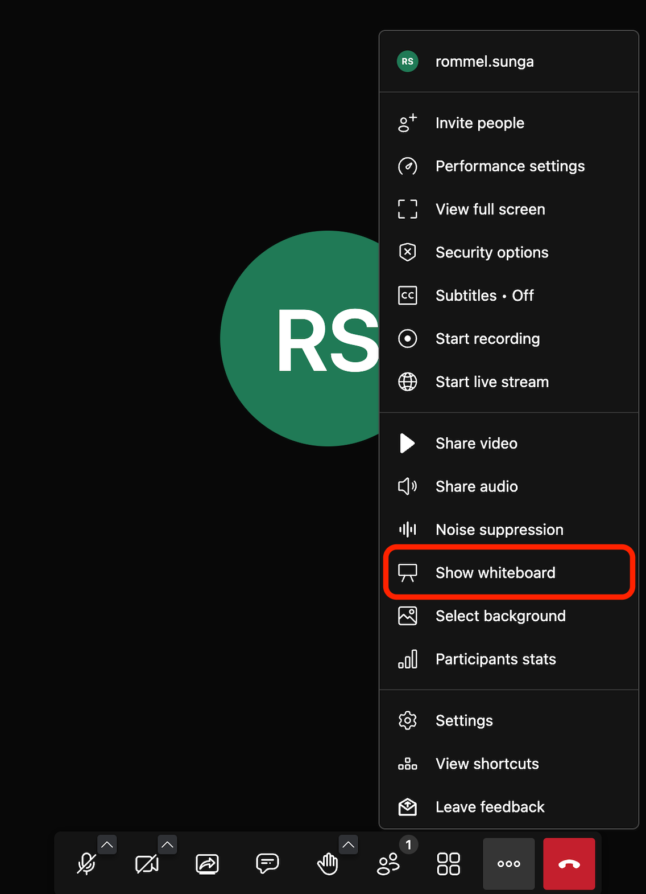
This will open a new whiteboard session for the current participant.

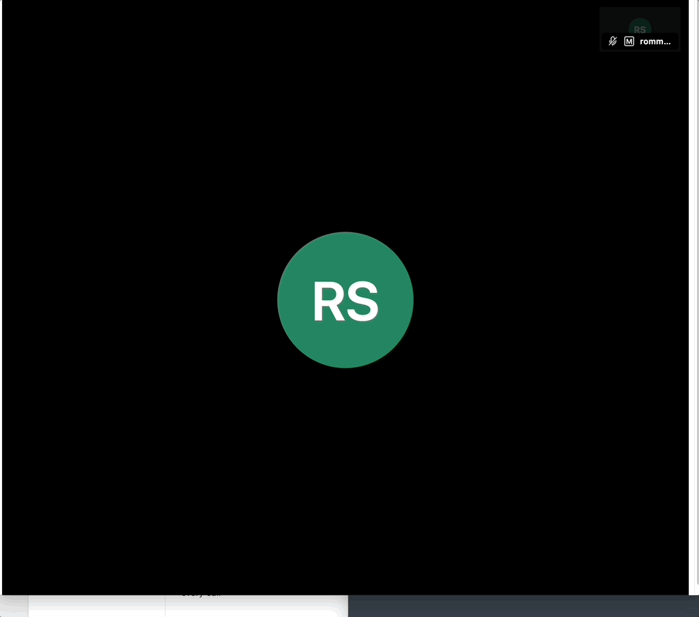

### Whiteboard Tools

There are several tools available including:

* **Arrow Tool:**  Select and move the different shapes and objects in the whiteboard. 

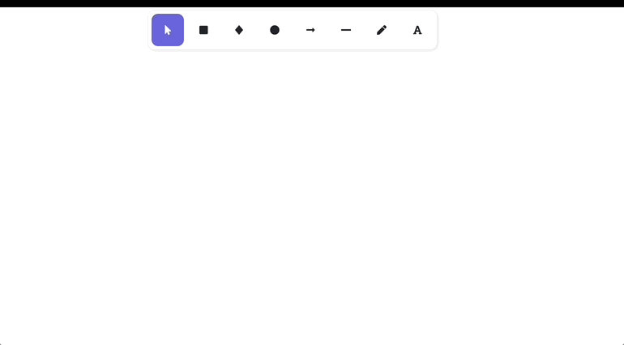
* **Square Tool:** Create a square with various line and background color options. 

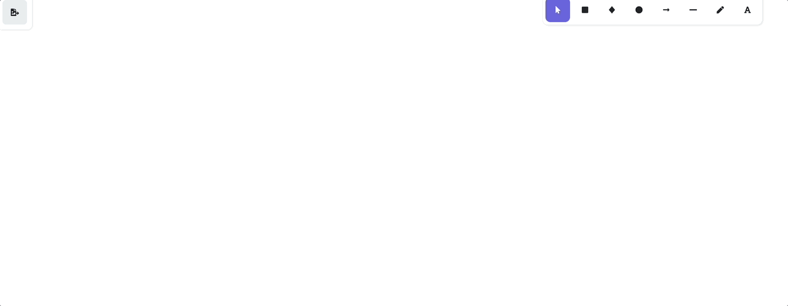
* **Diamond Tool:** Create a Diamond with various line and background color options. 

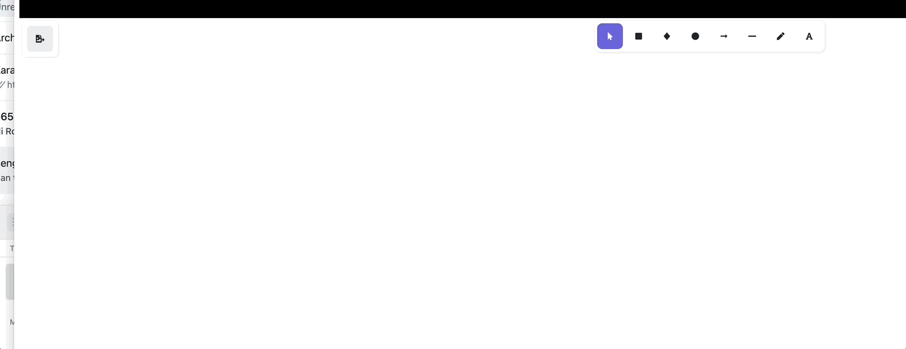
* **Circle Tool:** Create a Circle with various line and backround color options. 

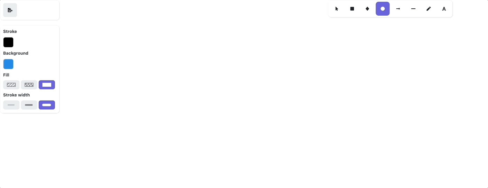
* **Arrow Tool:** Creates an arrow, can be connected to various shapes for drawing diagrams. 

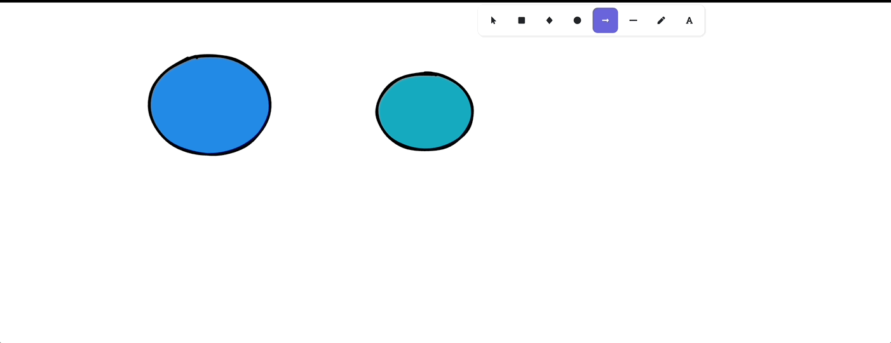
* **Line Tool:** Creates a line which can also be connected to various shapes for drawing diagrams. 

* **Pen Tool:** Allows freeform drawing with your cursor of any shape. 

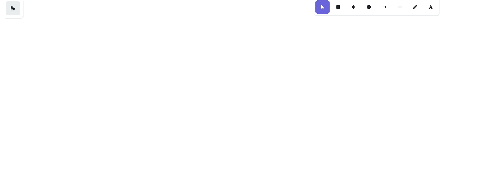
* **Text Tool:** Insert text into the whiteboard either by itself or as part of a shape for diagrams. 

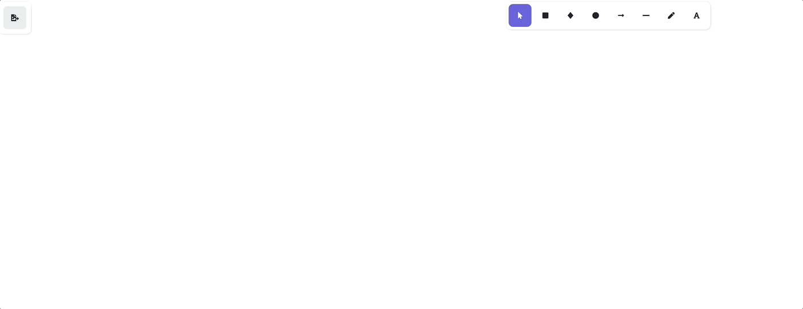

### Real Time Collaboration

All participants in the call can open the whiteboard and collaborate on a diagram in real time. This includes resizing and editing the shapes others draw as well as adding your own shapes. The changes will be reflected on real time on other participants screens.

  

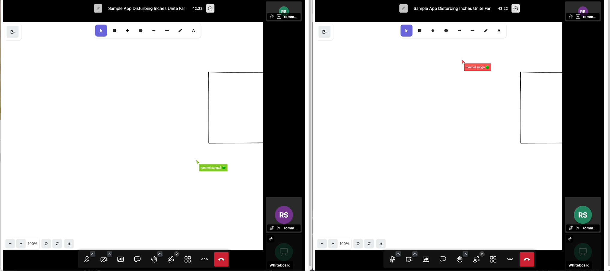The GIF shows two separate participants connected to the same room. They are able to use the whiteboard feature simultaneously and see each other's changes in real-time.

### Saving the Diagram

The whiteboard allows you to save either the entire diagram or a partial diagram through the **Save Button**. You can use the **Arrow Tool** to select only a portion of the diagram to save as an image. The image can be downloaded to your browser as either a **.png** or .**svg** file.

  

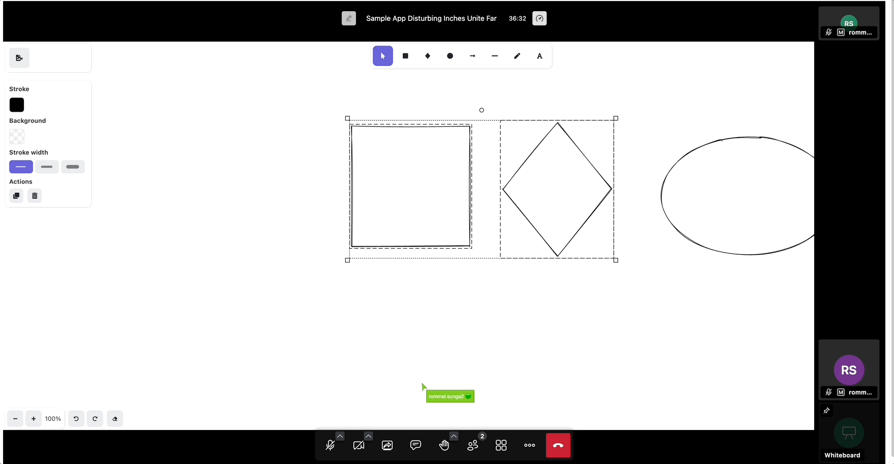

### Known Limitations

Here are some of the known limitations of the Whiteboard feature.

* The **maximum number of participants** in a meeting that can collaborate on a whiteboard is **25**.
* You can only save the whiteboard in **PNG** or **SVG** format, and you **cannot reuse it in another meeting**.

### FAQ

Here are some commnly asked questions with the Whiteboarding feature.

| Issue | Recommendation |
| --- | --- |
| No whiteboard visible in meeting? | Check to see that you have administrator privileges in the room. If you are moderator, ensure you click **Show Whiteboard** in the more actions / triple dot menu as shown in the **Open Whiteboard** section above. |
| How do I hide the whiteboard? | Open the **More Actions / Triple Dot menu** again and click **Hide Whiteboard** which should be located in the same place as **Open Whiteboard** was. |
| How do I share a PDF file in the whiteboard? | Currently the whiteboard does not support sharing PDF sharing. |
