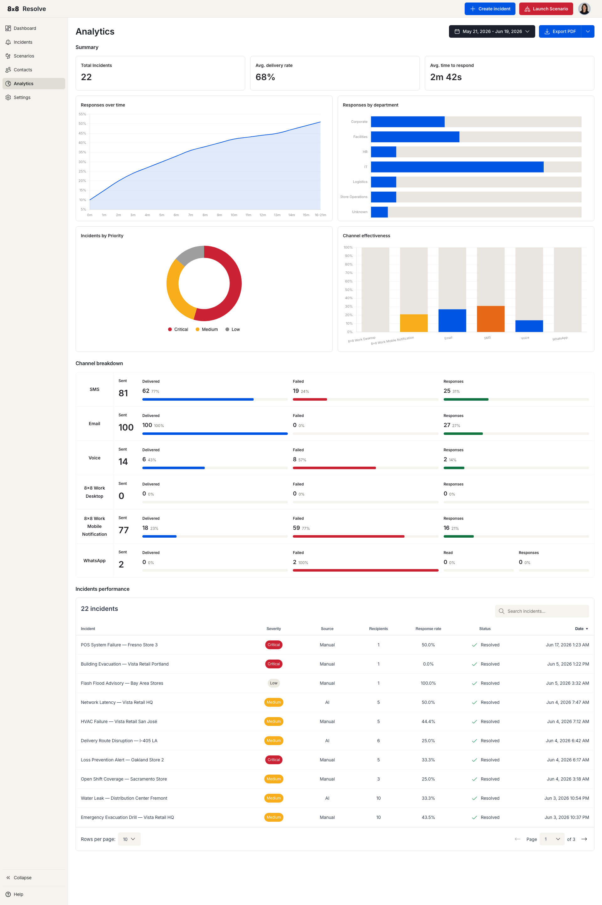

# Analytics

← [Back to Overview](./overview.md)

The Analytics page shows how your alerting is performing over time — delivery, response, and channel effectiveness across all your incidents. Use it to spot which channels reach people, how quickly recipients respond, and which departments are slow to acknowledge.

Pick a date range at the top right to scope every metric, chart, and table on the page. Use **Export** to download the current view — choose **PDF** for a formatted report or **CSV** for the underlying data.

## Key metrics

The top of the page summarises performance across the selected period:

| Metric | What it measures |
| --- | --- |
| **Total Incidents** | Number of incidents sent in the period. |
| **Avg. delivery rate** | Average percentage of messages successfully delivered to recipients. |
| **Avg. time to respond** | Average time between an incident being sent and a recipient responding. |

## Charts

| Chart | What it shows |
| --- | --- |
| **Responses over time** | Response volume across the period, so you can see trends and spikes. |
| **Responses by department** | How responsiveness breaks down across departments. |
| **Incidents by Priority** | The split of incidents by severity (Critical, Medium, Low). |
| **Channel effectiveness** | A channel-by-channel **Channel breakdown** of **Sent**, **Delivered**, **Failed**, **Responses**, and **Read** counts across SMS, Email, Voice, 8x8 Work Desktop, 8x8 Work Mobile Notification, and WhatsApp — use it to compare how each channel performs. |

## Incidents performance

Below the charts, the **Incidents performance** table lists each incident with its key outcomes:

| Column | Description |
| --- | --- |
| **Incident** | The incident title and when it was sent. |
| **Severity** | Critical, Medium, or Low. |
| **Source** | Manual or Automation. |
| **Recipients** | Number of people targeted. |
| **Response rate** | Percentage of recipients who responded. |
| **Status** | Active or Resolved. |
| **Date** | When the incident was created. |
