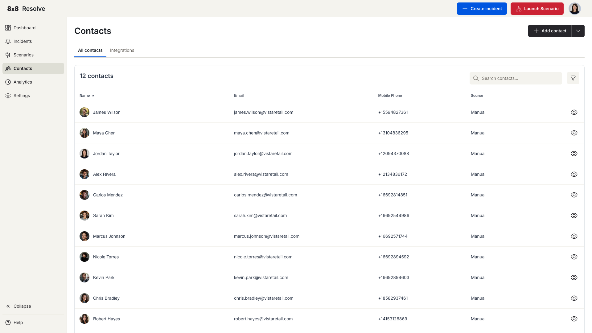
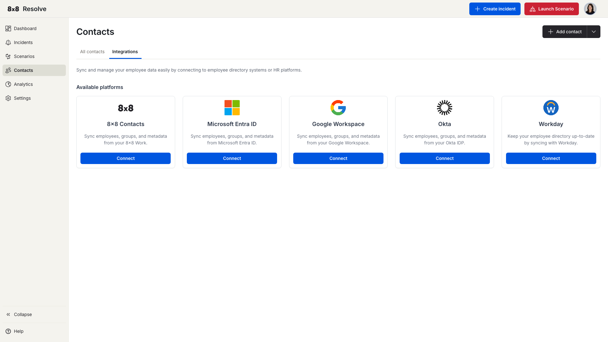

# Contacts

← [Back to Overview](./overview.md)

Your contacts are the people who can receive incidents. You can manage them manually, import them from a CSV file, or keep them in sync automatically by [connecting an HR system](#integrations).



## View your contacts

Navigate to **Contacts** from the left menu. The **All Contacts** tab opens by default and shows your full contact list; the **Integrations** tab is where you [connect an HR system](#integrations).

| Column | Description |
| --- | --- |
| **Name** | The contact's full name. |
| **Email** | Their email address. |
| **Mobile Phone** | Their mobile number. Shows "–" if not set. |
| **Source** | Where the contact was imported from (e.g., 8x8 Work, Google Workspace). |
| **Actions** | Click the eye icon to view full contact details. |

The total contact count is shown above the table and updates when you apply filters.

## Search and filter

- **Search** — Enter a name or email address to filter the list as you type.
- **Department** — Filter by the contact's department.
- **Role** — Filter by the contact's role.
- **Location** — Filter by the contact's office or site.

Select your filter values and click **Apply**. Click **Reset** to clear all filters and show the full list again.

> 📘 **Tip**
>
> You can combine the search field with filters. For example, search for "John" and filter by Department: "Engineering" to find a specific contact quickly.

## Add a contact manually

1. Click **Add Contact**.
2. Fill in the required fields.
3. Click **Save**. The contact appears in the list immediately.

## Upload contacts from a CSV

1. Click the dropdown arrow next to **Add Contact**.
2. Select **Upload contacts**.
3. Choose your CSV file and start the upload. A progress bar shows you how the import is going.

## View contact details

Click the **View** (eye) icon on a row — or click anywhere on the contact's row — to open that contact's details page. From there you can review and **edit the contact's properties** (name, email, phone, department, location, and group).

## Integrations

Connect your HR system to 8x8 Resolve from the **Integrations** tab and your contacts stay in sync automatically. When an employee's department, location, or phone number changes in your HR system, Resolve picks it up — so your incident targeting is always accurate.



Each sync maps the contact's **Name, Email, Phone, Department, Location, and Group**. Connections use secure API authentication (OAuth 2.0), data is isolated per tenant so it's never shared between 8x8 customers, and failed syncs are logged and retried automatically.

Supported sources:

- **8x8 Contacts App** — contacts already held in your 8x8 account.
- [Microsoft Entra ID](#microsoft-entra-id) (Azure Active Directory)
- [Google Workspace](#google-workspace)
- [Okta](#okta)
- [Workday](#workday)

### Connect an integration

1. Navigate to **Contacts** → **Integrations** tab.
2. Find the card for your HR system and click **Connect**.
3. Enter the required credentials for your system (see the sections below).
4. Click **Test Connection** to verify everything is working.
5. Click **Connect** to save. Your integration appears in the connected platforms list.

Once connected, click **Manage** on the integration card to view sync history or trigger a manual sync.

### Target contact groups

Employee groups from your source system (for example, "Engineering Team" or "US-Based Employees") sync across automatically and appear as named groups in the **Recipients** selector when you create an [incident](./incidents.md) or [scenario](./scenarios.md). There's no manual setup — when someone changes department or location in the source system, the matching group updates automatically, so your targeting stays accurate.

### Sync history

Every time Resolve syncs with your HR system, it logs the result here:

| Column | Description |
| --- | --- |
| **Job ID** | Unique identifier for the sync run. |
| **Status** | Whether the job succeeded or failed. |
| **Total Contacts** | Number of contacts found in the source. |
| **Synced** | Contacts successfully imported or updated. |
| **Started At** | When the job began. |
| **Finished** | When the job completed. |
| **Expand (∨ / ∧)** | Click to see a per-job breakdown: **Added**, **Updated**, and **Deleted** counts. An **Export .csv** button downloads the full details of that sync job. |

Click **Sync now** in the integration panel to trigger an immediate sync outside the daily schedule.

### Remove an integration

In the **Manage** panel, click **Remove integration**. A confirmation dialog shows how many contacts will be deleted. Confirm to remove the integration and all contacts it imported.

---

### Google Workspace

**You'll need:**

| Credential | Description |
| --- | --- |
| **Credentials JSON** | A JSON credentials file for a Google Service Account with delegated Domain Wide Authority. |
| **Email Address** | The email address of the workspace admin who created the service account. |

**How to set it up:**

1. Follow Google's [Domain Wide Delegation of Authority](https://developers.google.com/admin-sdk/directory/v1/guides/delegation) guide to create a service account. You'll need a Google Workspace administrator to do this.
2. Grant the service account the following OAuth scopes:
   - `https://www.googleapis.com/auth/admin.directory.user.readonly`
   - `https://www.googleapis.com/auth/admin.directory.group.readonly`
   - `https://www.googleapis.com/auth/admin.directory.orgunit.readonly`
3. Download the JSON credentials file.
4. Paste the JSON and your admin email address into the Resolve integration form.

---

### Microsoft Entra ID

**You'll need:**

| Credential | Description |
| --- | --- |
| **Tenant ID** | The tenant ID of the account that will read your user directory. |
| **Client ID** | The client ID of your registered application. |
| **Client Secret** | The client secret of your registered application. |

**How to set it up:**

1. [Register an application](https://learn.microsoft.com/en-us/entra/identity-platform/quickstart-register-app) in Microsoft Entra ID.
2. Create a client secret under **Certificates and Secrets**.
3. Grant the following API permissions under your registered app (all Application type):

   | Permission | Type | Requirement |
   | --- | --- | --- |
   | `User.Read.All` | Application | Admin approval required |
   | `Group.Read.All` | Application | Admin approval required |
   | `Directory.Read.All` | Application | Admin approval required |

4. Copy the Tenant ID, Client ID, and Client Secret into the Resolve integration form.

> 🚧 **Client secret expiry**
>
> Client secrets expire based on the duration you set when creating them. Update the secret in Resolve before it expires — expired credentials will cause sync jobs to fail.

---

### Okta

**You'll need:**

| Credential | Description |
| --- | --- |
| **Domain** | Your Okta organisation domain — the `MY_DOMAIN` part of `https://MY_DOMAIN.okta.com/`. |
| **API Token** | A personal API token with at least the Read-Only Administrator role. |

**How to set it up:**

1. Follow Okta's guide to [create a personal API token](https://help.okta.com/en-us/content/topics/security/api.htm?cshid=ext-create-api-token#create-okta-api-token).
2. Assign the token a **Read-Only Administrator** role at minimum.
3. Enter your domain and API token into the Resolve integration form.

> 🚧 **API token expiry**
>
> Depending on your Okta configuration, API tokens may expire. Update the token in Resolve before it expires to avoid sync failures.

---

### Workday

**You'll need:**

| Credential | Description |
| --- | --- |
| **Report URL** | The URL to your Workday RaaS (Report as a Service) report, in JSON format. |
| **Username** | Username of the account with access to the report. |
| **Password** | Password of that account. |

**How to set it up:**

1. Create a Custom Report in Workday that outputs employee contact data.
2. Get the report URL in JSON format — it will look something like:
   `https://wd5-impl-services1.workday.com/ccx/service/customreport2/your_org/report_name?format=json`
3. Enter the report URL, username, and password into the Resolve integration form.

**Required report format:**

Your Workday report must return data in this exact structure. Key names must match exactly — including capitalisation.

```json
{
  "Report_Entry": [
    {
      "Contact_Number": "+1 411 111 1111",
      "Department": "Sales",
      "Email_Address": "johnsmith@email.com",
      "First_Name": "John",
      "Job_Title": "Product Manager",
      "Last_Name": "Smith"
    }
  ]
}
```

---

### Integration security

> 📘 **Recommended: use a dedicated read-only account**
>
> For each integration, we recommend creating a dedicated service account with read-only access. This limits the blast radius if credentials are ever compromised.
>
> All credentials you enter are stored encrypted. Sensitive values are never returned in plain text — even users with admin access cannot view them after they've been saved.
