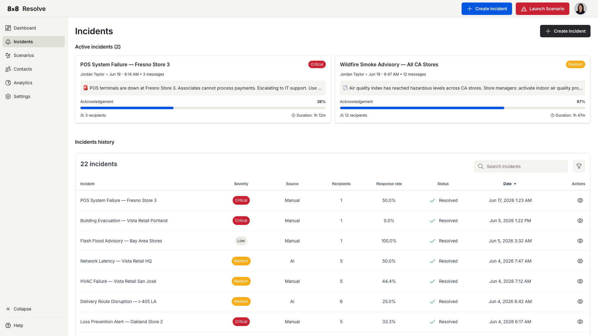
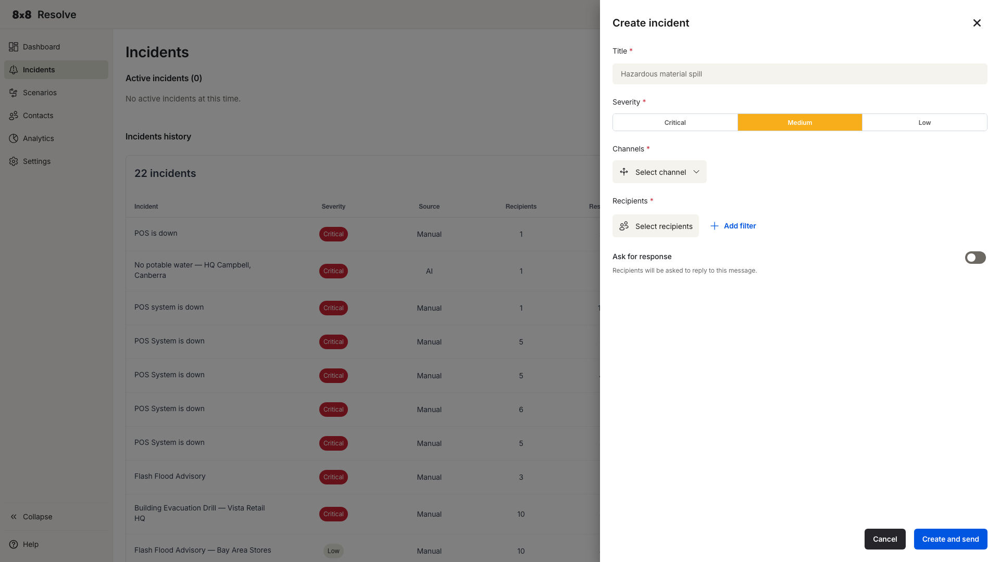
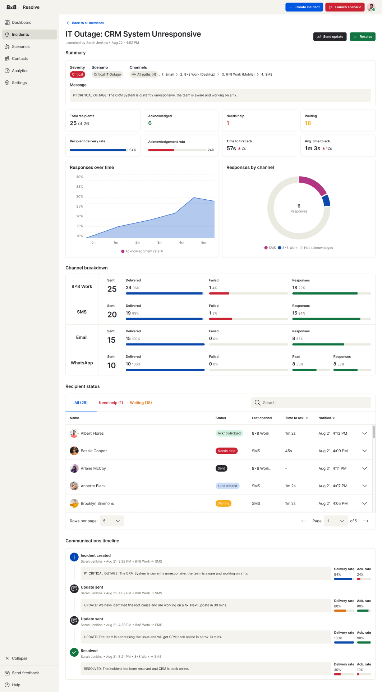

# Incidents

← [Back to Overview](./overview.md)

An incident is an alert you send to a group of recipients through one or more communication channels. You can create one manually at any time, or trigger one automatically through a [Scenario](./scenarios.md).



## Create an incident

1. Click **+ Create Incident** in the navigation bar. The Create Incident panel opens on the right.
2. Fill in the incident details:

   | Field | Description |
   | --- | --- |
   | **Title** | A short name or summary of the incident (e.g., "Incidents test"). |
   | **Severity** | The incident's impact level — **Critical** (red), **Medium** (amber), or **Low**. This drives the visual indicators in the incident list. |
   | **Channels** | A multi-select of delivery channels — pick any combination (see [Delivery channels](#delivery-channels)). Selected channels appear as tags inline in the field. |
   | **Template** | A predefined message template. The message body auto-populates below the selector and is editable before sending; it supports variables such as `{{firstName}}`. Use the ✕ button to reset the selection. |
   | **WhatsApp Template** | A separate WhatsApp-specific template (used when WhatsApp is a selected channel), with an inline preview of the formatted message and any template buttons. Clear it with the ✕ button. |
   | **Recipients** | Click **Select recipients** (the button shows a live count) to choose who receives the alert. See [Target specific recipients](#target-specific-recipients). |
   | **Ask for response** | Optional toggle to collect replies from recipients. See [Ask for response](#ask-for-response). |

3. Click **Create and Send** to dispatch the alert immediately, or **Cancel** to discard it.

> 📘 **Required fields**
>
> Title, Channels, and a Template are required. If you click **Create and Send** without filling them in, each empty field shows a red border and a "Field is required" message.



## Delivery channels

You can send an incident over any combination of these channels:

| Channel | How it reaches the recipient |
| --- | --- |
| **8x8 Work Desktop** | Notification in the 8x8 Work desktop app. |
| **8x8 Work Mobile Notification** | High-priority push notification via the 8x8 Work / Resolve mobile app, delivered even when the app is in the background or the screen is locked. |
| **Email** | Email to their address. |
| **SMS** | Text message to their mobile number. |
| **Voice** | Automated voice call to their phone. |
| **WhatsApp** | Message to their WhatsApp number, sent using the selected **WhatsApp Template**. |

Selected channels are shown as tags inline within the **Channels** field; you can pick all of them or any individual combination.

## Target specific recipients

Use the **Recipients** section to send the incident to a subset of your contacts. Filter by:

- **Department** (e.g., Finance)
- **Location** (e.g., New York Office)
- **Role** (e.g., Supervisor)

Click **Add filter** to combine multiple criteria. The incident goes only to recipients who match all of the filters you've applied.

## Ask for response

Enable the **Ask for response** toggle to prompt recipients to reply to the incident. When it's on, three settings appear:

**Response type** — what kind of reply you're collecting:

| Type | Behaviour |
| --- | --- |
| **Standard** | Pre-set, read-only options: **I acknowledge** and **I need help**. |
| **Custom poll** | Define your own options — up to five label/keyword pairs. Add them with **+ Add option**, delete any individually, and use **Preview** to check how they'll look. |

**Method** — how recipients submit their response:

| Method | How recipients respond |
| --- | --- |
| **Web link** | Recipients respond via a web-based link. |
| **Keyword reply** | Recipients respond by replying with the defined keyword (for example, over SMS). |

**Response options** displays the configured choices — the read-only *I acknowledge* / *I need help* for Standard, or your label/keyword pairs for a Custom poll.

You can track response rates in real time from the incident details page and the dashboard.

---

## Recipient response experience

When **Ask for response** is enabled, what the recipient sees depends on the **Method** chosen.

### Web link

The recipient receives a unique URL through their delivery channel. Opening it loads a hosted response page.

**Page layout:**

- **Header bar** (dark, full-width) — 8x8 Resolve brand mark.
- **Response card** (centred) — contains:

| Element | Description |
| --- | --- |
| **Severity pill** | Coloured pill showing severity in uppercase (e.g., **CRITICAL** in red, **MEDIUM** in amber). |
| **Relative timestamp** | Time since the incident was sent (e.g., *"0 minutes ago"*). Updates as time passes. |
| **Incident title** | Bold heading from the Create Incident panel. |
| **Message body** | The sent message with template variables resolved. |
| **Response buttons** | One full-width button per configured option (see below). |

**Standard response type** — two buttons:

- **Acknowledge** (blue, checkmark icon) — records an *I acknowledge* response.
- **I need help** (red, warning icon) — records an *I need help* response.

The buttons are mutually exclusive. Each recipient's URL is unique and tied to their identity — no login required. Responses feed into the incident's response tracking and are used by Condition nodes in scenarios.

**Custom poll** — one full-width button per configured option, in the order defined in the Create Incident panel.

### Keyword reply

The incident is delivered as plain text. The original message body is followed by one instruction line per configured response option:

```text
Reply {keyword} for {label}.
```

The recipient sends the keyword back as a regular reply on the same channel — no link or app required. Responses are attributed by sender phone number or WhatsApp ID. Any reply that doesn't match a configured keyword is treated as *Not responded*.

**Example (SMS with a custom poll):**

```text
This is a incidents sms test.

Reply Yes for Acknowledge.
Reply No for Need Help.
```

---

## Incidents page

Navigate to **Incidents** from the left menu to see all your past and active incidents.

### Active incident cards

The top of the page shows a card for each incident that's still active. Each card shows the title, severity, message preview, acknowledgement percentage, recipient count, and duration.

### Incidents history table

Below the cards, the history table lists every incident with these columns:

| Column | Description |
| --- | --- |
| **Incident** | The incident title. |
| **Severity** | Critical or Medium. |
| **Source** | Manual (created by a user) or Automation (triggered by a scenario). |
| **Recipients** | Number of people targeted. |
| **Ack rate** | Percentage of recipients who acknowledged. |
| **Status** | Active or Resolved. |
| **Date** | When the incident was created. |
| **Actions** | Open the incident details. |

### Search, filter, and sort

- **Search** — Type a keyword to filter the table instantly.
- **Date range** — Show only incidents from a selected period.
- **Severity** — Filter by Critical or Medium.
- **Source** — Filter by Manual or Automation.
- **Status** — Filter by Active or Resolved.

Combine as many filters as you need, then click **Apply**. To start fresh, click **Reset** — this clears all filters and restores the full list.

> 📘 **Filter persistence**
>
> Your active filters stay in place when you open an incident and come back. You won't lose your filter state just by navigating away.

### Resolve an incident

Open an incident and click **Resolve**. The status in the history table updates to **Resolved** straight away. The incident details page shows the full picture — delivery and response metrics, the recipient list, and a communications timeline of every update through to resolution.


