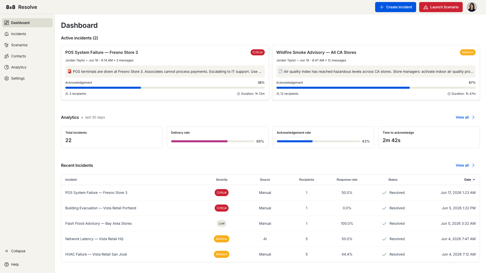

# 8x8 Resolve

8x8 Resolve is a critical communications platform that helps your organisation reach the right people instantly during an incident. Send targeted alerts across SMS, email, voice, WhatsApp, and mobile push — then track who acknowledged and who needs help, all in real time.

## What you can do

- **Create and send incidents** — Dispatch an alert to your entire organisation or a specific group in seconds.
- **Automate workflows** — Build scenarios that trigger on a schedule, branch on acknowledgement status, and escalate automatically.
- **Sync your contacts** — Keep your recipient list up to date by connecting your HR system (Google Workspace, Microsoft Entra ID, Okta, or Workday).
- **Monitor delivery** — Track delivery rates, acknowledgement rates, and response times from the dashboard.

## Get started

| Guide | What you'll learn |
| --- | --- |
| [Dashboard](./dashboard.md) | Navigate the home screen and read your key metrics. |
| [Incidents](./incidents.md) | Create an incident and send it across multiple channels. |
| [Scenarios](./scenarios.md) | Build automated alert workflows with triggers, actions, and conditions. |
| [Contacts](./contacts.md) | Add, search, and manage recipients, and connect an HR system via the Integrations tab. |
| [Analytics](./analytics.md) | Track delivery, response rates, and channel effectiveness over time. |
| [Settings](./settings.md) | Manage message templates, channels, and sender identities. |
