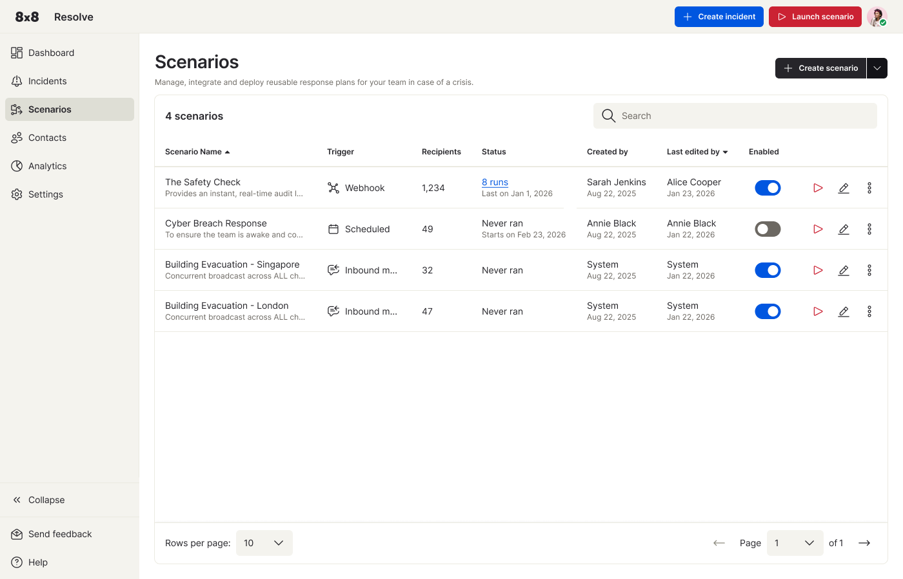
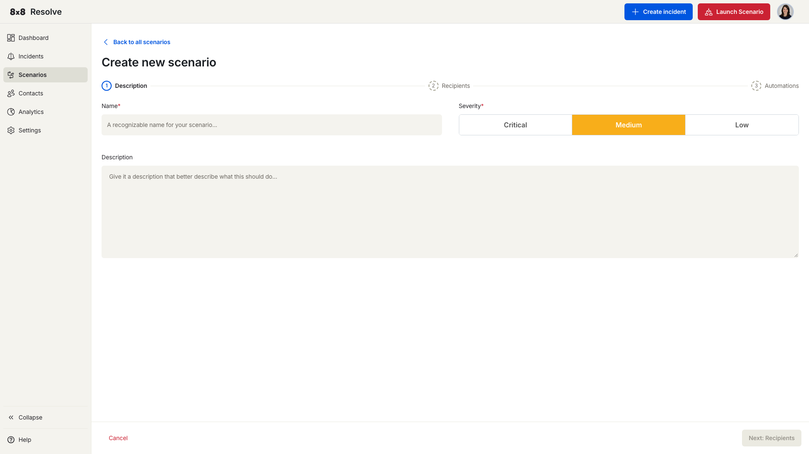
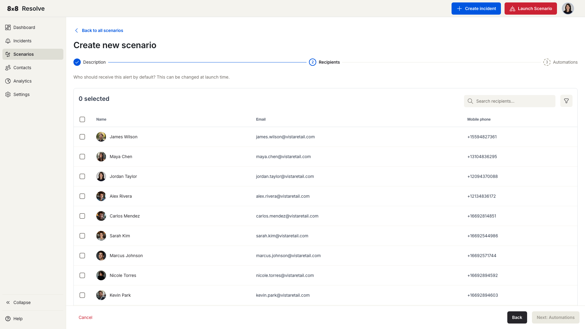
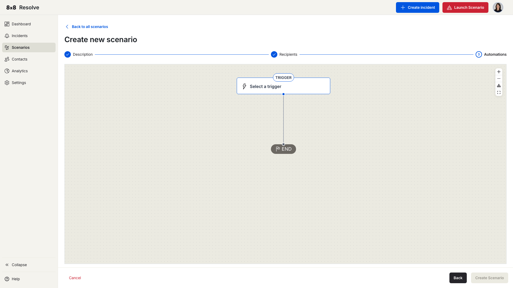
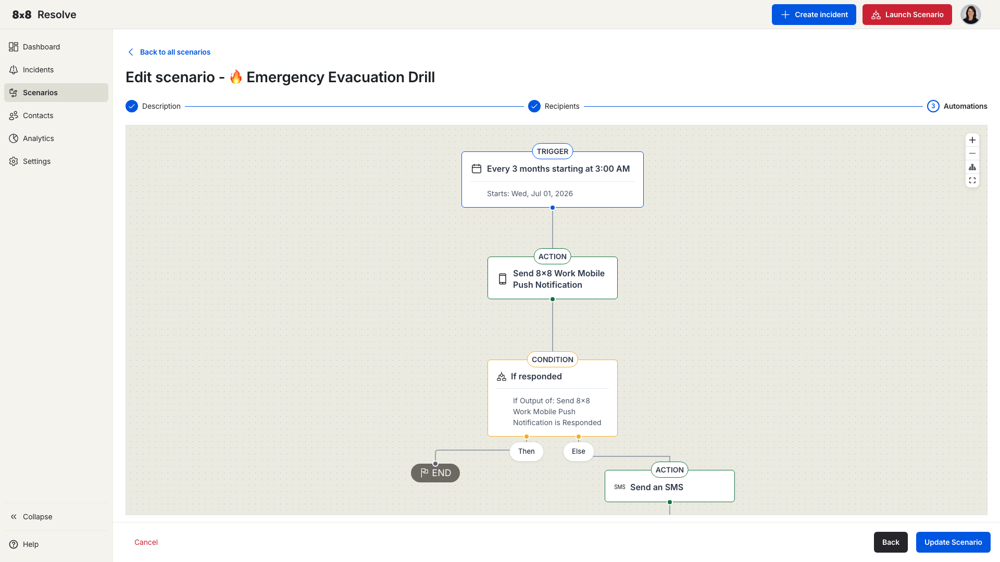

# Scenarios

← [Back to Overview](./overview.md)

Scenarios are pre-built alert workflows that run automatically on a trigger. A scenario can send messages across multiple channels, wait for acknowledgements, branch based on responses, and escalate — all without manual intervention.

## The Scenarios list

The **Scenarios** page lists every scenario you've created and is where you manage, launch, and build new ones. The header shows the total scenario count and a **search** box to find a scenario by name. From the top navigation you can also **+ Create incident** or **▷ Launch scenario** (run an existing scenario immediately).

Each row in the table shows:

| Column | Description |
| --- | --- |
| **Scenario Name** | The name, with a short description beneath. |
| **Trigger** | How the scenario fires: **Webhook**, **Scheduled**, or **Inbound message**. |
| **Recipients** | Number of recipients targeted by default. |
| **Status** | Run history and schedule (e.g., "8 runs – Last on Jan 1, 2026" or "Never ran – Starts on Feb 23, 2026"). |
| **Created by** / **Last edited by** | The user and date. |
| **Enabled** | Toggle to activate or disable the scenario. When off, the play and edit actions are greyed out. |

Per-row actions: **▷ Play** to launch immediately, **✏️ Edit** to open the three-step editor, and **⋮ More** for **Duplicate**, **Download**, or **Delete**.

## Create a scenario

Click **+ Create scenario** (top right of the list) and choose one of two options:

- **Create scenario** — starts the three-step guided workflow described below.
- **Upload scenario** — imports a previously downloaded scenario file.

A progress bar across the top tracks the three steps. You can **Cancel** at any time, or use **← Back to all scenarios** to exit without saving.

### Step 1: Description

Give your scenario a **Name** (required) and a **Severity** — **Critical**, **Medium**, or **Low** — plus an optional **Description**. The severity applies to any incident this scenario creates when it runs.

Click **Next: Recipients** when you're ready.

### Step 2: Recipients

Select the contacts who will receive alerts when this scenario fires. Search by name or select from the list. The count updates as you select.

Click **Next: Automations** to build the workflow.

### Step 3: Automations

Choose a pre-built automation template to get started quickly, or click **Start from scratch** to build your own.

When building from scratch, add nodes to the canvas in sequence: start with a **Trigger**, then add **Actions**, **Delays**, and **Conditions** as needed.

## Building the workflow

The builder is a split view: a **left panel** for selecting and configuring nodes, and a **right canvas** that shows the automation as a connected graph.

The canvas starts with two nodes joined by a line:

- **Trigger** node (bolt icon) — labelled *Select a trigger* until you choose one.
- **End** node (flag icon) — marks the end of the flow.

Click the **Trigger** node to open *Select a trigger* in the left panel, pick a trigger, configure it, and click **Apply** — the node updates to show the configured trigger. Once a trigger is applied, an **Action** node appears between the trigger and the end; click it to open *Select an action*, choose an action, and configure it.

Each node has inline controls:

| Control | What it does |
| --- | --- |
| **Replace (↺)** | Swap the node for a different trigger or action. |
| **Code (`</>`)** | View the node's raw configuration. |
| **Delete (🗑)** | Remove the node. Action, Delay, and Condition nodes can be deleted; the Trigger node cannot. |

Use the canvas controls (zoom in/out, fit to screen, expand) to navigate larger workflows. Click **Create Scenario** (or **Update Scenario** when editing) to save.

---

## Triggers

Every scenario needs exactly one trigger. Currently supported:

### Scheduled time

Fires the scenario at a specific date and time.

| Option | Description |
| --- | --- |
| **Start date/time** | When the scenario first runs. |
| **Repeat** | Toggle on to repeat the trigger on a schedule. |
| **Repeat every** | How often to repeat — set a number and choose minutes, hours, or days. |
| **End** | When to stop repeating: **Never**, **On a specific date**, or **After a maximum number of occurrences**. |

### Message received

Fires when an **SMS** arrives on a Resolve virtual number.

| Option | Description |
| --- | --- |
| **Keyword** | **Any** fires for any incoming message; **Specific** fires only for keywords you list (up to 50). |
| **Allowed sender numbers** | Restrict the trigger to specific numbers in E.164 format (up to 50). Leave empty to allow any sender. |
| **Trigger once per person** | When on, the scenario fires only once per unique sender. |
| **Trigger every** | Set a cooldown interval (e.g., every 24 hours) before the same sender can fire it again. |

### WhatsApp message received

Fires when a **WhatsApp** message arrives on a Resolve WhatsApp channel. It offers the same options as **Message received** — keyword filtering (Any/Specific), allowed sender numbers, trigger once per person, and a cooldown interval.

### Webhook received

Fires when a POST request is sent to the scenario's auto-generated webhook URL (copyable from the trigger configuration). Use this to trigger scenarios from external systems. You can define the expected request body (JSON) so the payload is available to later steps in the automation.

---

## Actions

After the trigger, add one or more action nodes. Actions fall into two groups — **Notifications** and **Integrations**:

| Action | What it does |
| --- | --- |
| **Send 8x8 Work Message** | Sends a message via 8x8 Work. |
| **Send 8x8 Work Mobile Push Notification** | Sends a push notification through the 8x8 Work mobile app. |
| **Send an Email** | Sends an email to the recipients. |
| **Send an SMS** | Sends an SMS to the recipients' mobile numbers. |
| **Send Voice call** | Places an automated voice call to the recipients. |
| **Send WhatsApp message** | Sends a WhatsApp message through a Resolve WhatsApp channel. |
| **Send HTTP request** *(Integrations)* | Makes an outbound HTTP request to an external system. |

For message actions you can also set:

- **Ask for response** — Toggle on to request a reply from recipients.
- **Timeout** — How long (in minutes or hours) to wait for a response before the workflow continues.

---

## Delays

Add a **Delay** node between steps to pause before the next action runs. Two modes are available:

| Mode | Description |
| --- | --- |
| **Specified period** | Wait for a fixed duration — set an amount and unit (minutes, hours, days, weeks, or months). |
| **Scheduled date** | Pause until a specific date and time before the workflow continues. |

---

## Conditions

Add a **Condition** node to branch the workflow based on whether a previous action was acknowledged.

- **Then** path — Followed when the condition is met.
- **Else** path — Followed when the condition is not met. Use this to escalate through a different channel.

The condition checks the output of a prior action node. The observable values are:

| Value | When it triggers |
| --- | --- |
| **Responded** | The recipient replied within the timeout window. |
| **Not responded (timeout)** | The timeout elapsed with no reply received. |
| **Failed to deliver** | The message could not be delivered to the recipient. |

> 📘 **Example**
>
> Send an email → wait 30 minutes → check if acknowledged.
> If **yes** → end the workflow.
> If **no** → send an SMS as a follow-up.

---

## Save and launch

Click **Save scenario** at the end of the wizard. Your new scenario appears in the scenarios table with its name, trigger type, recipient count, and enabled/disabled status.

To run a scenario immediately without waiting for its scheduled trigger, click **Launch Scenario** in the navigation bar and select the scenario you want to run.
