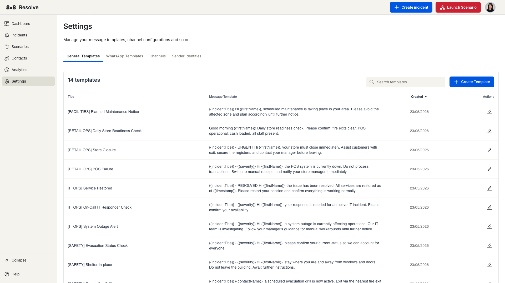

# Message Templates

← [Back to Overview](./overview.md)

Message templates are reusable messages you can pull into an [incident](./incidents.md) or a [scenario](./scenarios.md) instead of writing the text each time. A template can include **placeholders** that are automatically filled with the incident's details when the message is sent.

Templates live under **[Settings](./settings.md)**, which has separate **General Templates** and **WhatsApp Templates** tabs (alongside **Channels** and **Sender Identities**). This page covers General Templates.

## Templates list

The **General Templates** tab lists your existing templates:

| Column | Description |
| --- | --- |
| **Title** | The template name. |
| **Message Template** | A preview of the message body. |
| **Created** | When the template was created. |
| **Actions** | Edit or delete the template. |

## Create a template

Go to **Settings → Templates** and click **Create Template**. The Create Template dialog has two required fields:

| Field | Description |
| --- | --- |
| **Title** | The name of the template. Must be unique. |
| **Message Template** | The message body. Type your text and insert any of the placeholders below. |

The available placeholders are listed below the message box. Click **Create** to save — the template then appears in your Templates list and is available when creating incidents and scenarios.

## Placeholders

Placeholders are replaced with live values when the message is sent:

| Placeholder | Replaced with |
| --- | --- |
| `{{incidentTitle}}` | The incident's title. |
| `{{location}}` | The location associated with the incident. |
| `{{severity}}` | The incident severity (Critical, Medium, or Low). |
| `{{scenario}}` | The scenario that triggered the incident. |
| `{{timestamp}}` | The time the message is sent. |
| `{{contactName}}` | The recipient's full name. |
| `{{firstName}}` | The recipient's first name. |
| `{{lastName}}` | The recipient's last name. |

## Validation

- **Title** and **Message Template** are both required — leaving either empty shows an inline validation message.
- Template names must be unique; a duplicate title prompts you to choose another.
- If a server or network error occurs while saving, a general error notification appears.

Once saved, a template persists under **Settings → Templates** and can be reused whenever you create an incident or scenario.
