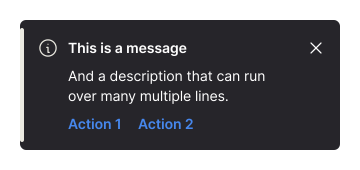

import PreviewColor from '@site/docusaurus/components/PreviewColor';

# Getting started as an 8x8 Technology Partner

## The purpose of this guide

8x8 is proud to provide a cohesive user experience for customers when using 8x8 products. Providing an easy to understand user experience and a consistent UI is essential in achieving that.

This guide helps to style your products to fit within the 8x8 ecosystem allowing a smooth user experience and easy to follow UI.

---

## Areas of focus when building for 8x8

#### Location

Integrations can be deployed where needed the most but the primary location is the "meta data" panel. It's a place where supporting content or integrations live to help the user complete tasks.

#### Style

The 8x8 design system is called Oxygen. It contains specifications for a large range of web and mobile components with guidance on how to use each one.

#### Accessibility

Accessible products and integrations are important. Any 3rd party integration deployed inside an 8x8 product should be WCAG 2.1 AA compliant.

#### Theme

8x8 products support switching between dark and light mode so integrations must also support dark and light styles.

---

## The meta data panel

The meta data panel is a common place where integrations could live inside 8x8. It's a place where supporting content and integrations can help users complete their tasks.

The meta data panel lives in the right-hand side of the UI and takes up just under half the size of the window. The UI is on a flexible grid so integrations should change width depending on the users screen size.

---

## 8x8 Notifications

If your integration has notifications we can feed the user events where ever they are in the app so they are aware when something happens.

If your integration supports notifications then here's an explanation of how they would work inside 8x8 and how they can be styled.

Notifications float in the top right corner of the UI. The user can dismiss or action them once they've seen it.

#### Types of notifications

The success message is shown when a task has been completed successfully

The warning message is shown when something might require the users attention

The error message is shown when something needs the users urgent attention

The info message can be used for anything else that the user needs to be notified on

## Oxygen - 8x8's design system

Oxygen is 8x8's design system. It's a comprehensive library of components and styles that make up the UI. It's been extended to help integrations style their own products to fit inside 8x8 products.

The design system includes three main components:

#### Color palette

- Primary: `#0056e0`
- Text: `#26252a`
- Background: `#FFFFFF`
- Success: `#127440`
- Warning: `#F8AE1A`
- Error: `#CB2233`

#### Typography

8x8 use the font Inter which is available and easily embeddable from Google fonts. The typography library contains 9 type styles covering small text to headings:

- `$label01`
- `$bodyBold01`
- `$heading01`
- `$heading02`

#### Iconography

A comprehensive icon library for consistent visual communication.

---

## Theme

In 8x8 products users can choose whether to use view in light or dark mode by switching in the settings. Therefore it's important integrations have the support for both light and dark themes.

#### Light mode

- Primary button bg and form controls: `#0056e0`
- Secondary button bg: `#26252a`
- Destructive button and errors: `#CB2233`
- Warnings and badge notifications: `#F8AE1A`
- Success: `#127440`
- Text and icons: `#26252a`
- Background color: `#FFFFFF`
- Secondary background color: `#F4F3EE`

#### Dark mode

- Primary button bg and form controls: `#246FE5`
- Secondary button bg: `#E0E0E0`
- Destructive button and errors: `#D83848`
- Warnings and badge notifications: `#F8AE1A`
- Success: `#189B55`
- Text and icons: `#ffffff`
- Background color: `#666666`

---

## Accessibility

Any 3rd party integration deployed inside an 8x8 product should be WCAG 2.1 AA compliant.

A comprehensive guide of WCAG 2.1 AA can be found here [https://www.w3.org/TR/WCAG22/](https://www.w3.org/TR/WCAG22/)

---

## Stickersheet

Common styles and components to get you started. For anything extra please reach out to us.

1. Typography
2. Color palette
3. Icons
4. Buttons
5. Form elements
6. Tabs, tags, loading and badges

---

#### Typography

**Inter**: [https://fonts.google.com/specimen/Inter](https://fonts.google.com/specimen/Inter)

| Style         | Weight | Size     | Line-height | Spacing   |
|---------------|--------|----------|-------------|-----------|
| $heading02    | 600    | 1.75rem  | 2.5rem      | -0.020rem |
| $heading01    | 600    | 1.25rem  | 1.75rem     | -0.017rem |
| $body02       | 400    | 1rem     | 1.5rem      | -0.011rem |
| $bodyBold02   | 600    | 1rem     | 1.5rem      | -0.011rem |
| $body01       | 400    | 0.875rem | 1.25rem     | -0.006rem |
| $bodyBold01   | 600    | 0.875rem | 1.25rem     | -0.006rem |
| $bulletList01 | 400    | 0.875rem | 1.5rem      | -0.006rem |
| $label01      | 400    | 0.75rem  | 1rem        | Normal    |
| $labelBold01  | 600    | 0.75rem  | 1rem        | Normal    |

---

#### Color Palette

| Light mode | Dark mode |
|------------|-----------|
| <PreviewColor color="#0056e0" />**Primary button bg and form controls** `#0056e0` | <PreviewColor color="#246FE5" />**Primary button bg and form controls** `#246FE5` |
| <PreviewColor color="#26252a" />**Secondary button bg** `#26252a` | <PreviewColor color="#E0E0E0" />**Secondary button bg** `#E0E0E0` |
| <PreviewColor color="#CB2233" />**Destructive button and errors** `#CB2233` | <PreviewColor color="#D83848" />**Destructive button and errors** `#D83848` |
| <PreviewColor color="#F8AE1A" />**Warnings and badge notifications** `#F8AE1A` | <PreviewColor color="#F8AE1A" />**Warnings and badge notifications** `#F8AE1A` |
| <PreviewColor color="#127440" />**Success** `#127440` | <PreviewColor color="#189B55" />**Success** `#189B55` |
| <PreviewColor color="#26252a" />**Text and icons** `#26252a` | <PreviewColor color="#ffffff" />**Text and icons** `#ffffff` |
| <PreviewColor color="#FFFFFF" />**Background color** `#FFFFFF` | <PreviewColor color="#666666" />**Background color** `#666666` |
| <PreviewColor color="#F4F3EE" />**Secondary background color** `#F4F3EE` | |

---

#### Iconography

A sample of our icon library

---

#### Buttons

**Primary button**

**Secondary button**

**Destructive button**

**Text button**

#### Form elements

**Text input**

**Checkbox**

**Toggle**

**Radio**

---

#### Inline notifications

**Success**

**Error**

**Info**

**Warning**

#### Others

**Tabs**

**Tags**

**Loading**

**Badge**

---

## Thank you

This guide is a small part of the documentation and specifications we can provide. For more details or direct help feel free to reach out to us.
