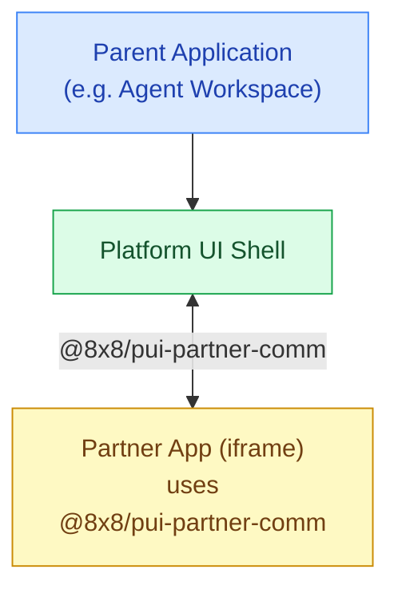

# Partner Integration Guide

The **partner integration** allows you to embed your web application as an iframe panel inside an 8x8 application. Your app communicates bidirectionally with both the **Platform UI Shell** and the **parent application** through the **`@8x8/pui-partner-comm`** SDK.

Use this integration when you want to:

- Provide an interactive UI panel within an 8x8 application workspace
- Receive real-time interaction events (calls on hold, chats received, agent wrap-up)
- Send and receive messages with the shell and parent application
- Exchange files bidirectionally
- React to context changes such as theme, locale, and active interaction

---

## Architecture

The integration has three layers. Your application runs as an iframe inside the **Platform UI Shell**, which itself is embedded inside a **parent application** (such as the Agent Workspace). Communication flows through `@8x8/pui-partner-comm`, which bridges your app to both the shell and the parent application above it.



The shell controls which events are forwarded to your application. 8x8 configures this **event allowlist** during integration setup — your app only receives the event types you have been granted access to.

---

## Prerequisites

Before starting, ensure you have:

- A web application served over **HTTPS** at a publicly accessible URL
- An agreement with 8x8 to register your application as a partner integration
- Your server configured to allow 8x8 to embed your app in an iframe — remove any `X-Frame-Options: SAMEORIGIN` or `DENY` header, or add a `Content-Security-Policy: frame-ancestors https://*.8x8.com` header instead
- *(Optional)* If your app sets cookies, mark them `SameSite=None; Secure` so they work inside a cross-origin iframe
- *(Optional)* A list of the [events](./partner-sdk-events) your integration needs access to — you can start without this and discover available events at runtime using `partnerSDK.system.getEvents()`

Contact [developer@8x8.com](mailto:developer@8x8.com) to register your application and agree on the event types your integration will use.

---

## Installation

### npm package

The `@8x8/pui-partner-comm` SDK is optional — your application can be embedded in the shell without it. However, without the SDK you will not have access to any of the communication features described in this guide, such as receiving events, sending messages, querying context, or transferring files.

```bash
npm install @8x8/pui-partner-comm
# or
yarn add @8x8/pui-partner-comm
```

```javascript
import * as partnerSDK from '@8x8/pui-partner-comm';
```

### UMD script tag

If your application does not use a module bundler, load the SDK via a script tag. Once loaded, the SDK is available as `window.partnerSDK`.

```html
<script src="https://unpkg.com/@8x8/pui-partner-comm@latest/dist/umd/pui-partner-comm.min.js"></script>
<script>
  // window.partnerSDK is now available
  window.partnerSDK.system.initialise({ ... });
</script>
```

---

## Step-by-step guide

### 1. Initialize the SDK

Call `system.initialise()` as early as possible in your application's lifecycle. The `onMessage` callback is how your app receives all messages and events from the shell.

```javascript
partnerSDK.system.initialise({
  appName: 'my-partner-app',    // unique identifier for your application
  appVersion: '1.0.0',          // current version of your application
  vendor: 'My Company',         // your company or organisation name
  onMessage: (message) => {     // callback invoked for every message received from the shell
    handleMessage(message);
  },
});
```

### 2. Handle incoming messages

Your `onMessage` callback receives a message object. Use the `type` field to route each message to the appropriate handler.

The `'event'` type is how shell events (such as interaction focus, hold, and mute) arrive — see the [Partner SDK Events](./partner-sdk-events) reference for the full list of available event types.

```javascript
function handleMessage(message) {
  switch (message.type) {
    case 'event':
      // An event from the shell (e.g. interaction focus, hold, mute)
      console.log('Shell event received:', message);
      break;
    case 'message':
      // A direct message from the shell
      console.log('Message:', message.message);
      break;
    case 'response':
      // A response to a request you made (e.g. getTheme, getLocale)
      console.log('Response:', message);
      break;
    case 'error':
      // An error from the shell
      console.error('Error:', message);
      break;
    case 'file_transfer':
      // An incoming file chunk
      break;
    case 'file_transfer_complete':
      // A file transfer has completed
      break;
  }
}
```

### 3. Query shell context

Use the `system` namespace to retrieve information about the shell environment. Responses arrive through your `onMessage` callback as `response` type messages.

```javascript
// Get the current UI theme
partnerSDK.system.getTheme();

// Get the current locale
partnerSDK.system.getLocale();

// Get the list of events your app is allowed to receive
partnerSDK.system.getEvents();

// Get context, SDK version information
partnerSDK.system.getContext();
partnerSDK.system.getVersion();
```

`getEvents()` returns a map of event names to their supported schema versions:

```json
{
  "type": "response",
  "message": {
    "namespace": "system",
    "request": "getEvents",
    "value": {
      "aw-interaction-hold-v1": ["1.0.0"],
      "aw-interaction-mute-v1": ["1.0.0"],
      "aw-interaction-focus-v1": ["1.0.0"]
    }
  }
}
```

### 4. Send events

Use `sendEvent` to send a typed, schema-validated event to the shell:

```javascript
partnerSDK.system.sendEvent('my-event-name', {
  schemaVersion: '1.0.0',
  // ... your event payload
});
```

Events must include a `schemaVersion` field. This allows both sides to handle multiple versions of the same event as your integration evolves.

For the full list of events you can send and receive, see the [Partner SDK Events](./partner-sdk-events) reference.

### 5. Send messages

Use `sendMessage` to send a custom message outside of the typed event system. Two forms are valid:

- **A plain string** — arrives on the shell side as `{ type: "message", message: <string> }`
- **An object with an explicit `type` string that is not `"message"`** — e.g. `{ type: "my-custom-type", message: "..." }`

Sending an object without a `type` field, or with `type: "message"` and a non-string `message` value, will throw an error. Numbers, booleans, `null`, and `undefined` are also invalid.

```javascript
// Valid: plain string
partnerSDK.system.sendMessage('Hello from partner app');

// Valid: object with an explicit custom type
partnerSDK.system.sendMessage({ type: 'my-custom-type', message: 'payload' });

// Invalid: object without type and non-string message — throws error
partnerSDK.system.sendMessage({ action: 'refresh', itemId: '123' });
```

> **Note:** Custom messages are only enabled if your partner app's URL has been added to the shell's allowlist by 8x8. If not enabled, messages will be silently dropped.

---

## Next steps

- Browse the full list of available events in the [Partner SDK Events](./partner-sdk-events) reference
- Review the full SDK API on [npm](https://www.npmjs.com/package/@8x8/pui-partner-comm)
- For questions or to register your integration, contact [developer@8x8.com](mailto:developer@8x8.com)
