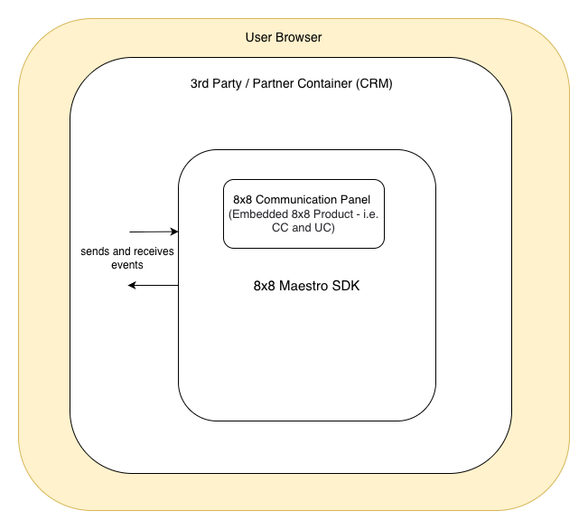
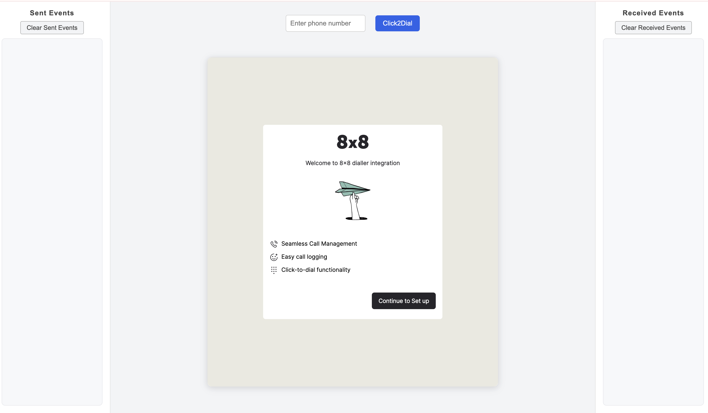
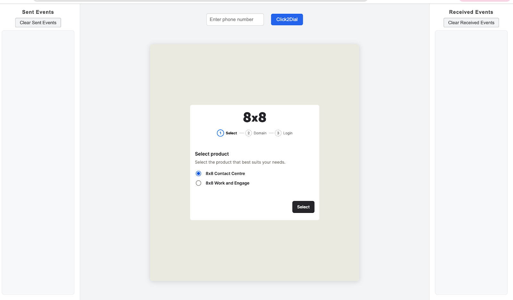

# overview

MaestroSDK publishes embeddable events and can be consumed by third-party developers to integrate core 8x8 products into their solutions.

 

Embeddable events are categorised into two categories based on the 8x8 products supported:

- **UC (Unified Communications) Events**
- **CC (Contact Center) Events**

These event types support different event states, such as:

- **Offered**
- **Accepted**
- **Completed**
- **Terminated**

## Example Use Cases

**Embedded 8x8 Work, Engage, and 8x8 Contact Centre**

**Click to Call**
- Click a correctly formatted phone number from within a third-party application.
- Initiate an outbound call via **8x8 Work**, **8x8 Engage**, or **8x8 Contact Centre**.

**Interaction Logging**
- Automatically create a call log as a third-party record containing **8x8 interaction data**.
- Includes details such as **call duration**, **call answer time**, and **call queue**.
- Triggered when **8x8 events** are received — e.g., *offered*, *connected*, *complete*, or *terminated*.

**Automated Record Creation**
- Automatically create a **third-party record**, such as a *new contact* in a **no-match** scenario.
- Prepopulate with **8x8 interaction data**, such as **phone number**.

**Screen Pop and Contextual Information**
- Automatically display a **third-party record** after performing a lookup for matching phone numbers.
- Provides contextual information for better user experience.

## Prerequisites

- The **end user** must provide their **domain** to **8x8** for **whitelisting** to enable end-to-end integration with the **Maestro SDK**.
To request whitelisting, please complete the designated **[form](https://docs.google.com/forms/d/e/1FAIpQLSdgC1fV8D93lzG1PH6I1oOjej2QuNDex-mNQymzHYrCHKyv0g/viewform?usp=preview)**.

- The **end user** must **possess or acquire the necessary licenses** to login and utilize **8x8 applications**. The email URL functionality is contingent upon a **successful login to VCC**, as an **SSO token** is required.

- The **Google Chrome** browser is **preferred** for optimal performance.

## MaestroSDK Integration

Integrate the below Computer Telephony Integration (CTI) URL into your application and provide 8x8 with the domain to whitelist, as mentioned in the Prerequisites.

### CTI URL to be integrated

```https://cloud8.8x8.com/mashell/public/index.html?env=embeddable&nextgen=true```

### Overview of Embeddable events

#### MaestroSDK Live Demo

Experience the MaestroSDK integration in action by clicking Open MaestroSDK Demo below. This demo illustrates how events are sent to and received from the MaestroSDK in real time.

import Link from '@docusaurus/Link';

<Link to="/demos/maestro-sdk/" target="_blank">Open MaestroSDK Demo</Link>

1. The 8x8 production selection page will be displayed as shown below. All events sent to 8x8 MaestroSDK will be displayed on the left side under "Sent Events," and
 all received events from MaestroSDK will be displayed under "Received Events" on the right side.
    

2. After clicking “Continue to Setup” from the previous page, select 8x8 Contact Centre for CC and 8x8 Work and Engage for UC accordingly.
    

3. Please enter your assigned VCC domain as illustrated below.
    

4. The VCC Login page will be displayed as shown below, requiring VCC login credentials.
    

### Click to Dial

This event is initiated by the third-party and sent to the **Maestro SDK**.
It supports **outbound voice phone features** for both **UC** and **CC**, and the SDK processes the event according to the defined workflow once it is received.

Below is a **sample event structure** that the third-party should use to pass the event to the Maestro SDK.

```json
{
  "eventName": "maEvent",
  "family": "external",
  "content": {
    "eventName": "startCall",
    "method": "mapDirective",
    "phoneNumber": "+1234567890"
  }
}
```

#### Event Attribute Details

| Property                  | Description                                            | Type                                                                                                                            |
| :------------------------ | :----------------------------------------------------- | :------------------------------------------------------------------------------------------------------------------------------ |
| **`eventName`** (\*)        | Name of event (parent)                               | `'maEvent'`                                                                                                                        |
| **`family`** (\*)         | Event family                                           | `'external'`                                                                                                                    |
| **`content`** (\*)      | Holds details of event                                 | *Object with properties:*<br />• **`eventName`** (\*): `string` - Event name to trigger c2d outbound call<br />• **`method`** (\*): `string` - Events published from third party to Maestro SDK  are named as mapDirective<br />• **`phoneNumber`** (\*): `string` - Phone number on which click to dial is triggered |
| **`schemaVersion`** (\*)  | Current schema version of the event                    | `'1.0.0'`                                                                                                                       |

*(\*) Required.*

### Error Events

Events published from the **Maestro SDK** undergo **validation checks** before being sent to the third-party.
If any validation fails, the event response will include an **error message** to assist with debugging.

For example, if an error occurs in [mashell-chat-nextgen-terminated-cc-event-v1](events/mashell-chat-nextgen-terminated-cc-event-v1.md), the error response would be as shown in the sample below:

#### Sample Event Object for `INVALID_SCHEMA`

This error occurs when the event payload is validated against the allowed schema version but **fails validation** due to:

- Incorrect **field datatype**
- Missing **mandatory field value**
- Missing **required field**

The sample event object below illustrates this scenario:

```json
{
   "eventType": "mashell-chat-nextgen-terminated-cc-event-v1",
   "status": "failed",
   "data": {
      "eventName": "dummyEventName",
      "error": "INVALID_SCHEMA",
      "schemaVersion": "1.0.0",
      "allowedSchemaVersions": ["1.0.0"],
      "validSchema": false,
      "errorDescription": [
         {
            "received": "dummyEventName",
            "code": "invalid_literal",
            "expected": "terminated",
            "path": ["eventName"],
            "message": "Invalid literal value, expected 'terminated'"
         },
         {
            "code": "invalid_literal",
            "expected": "2.0.0",
            "path": ["schemaVersion"],
            "message": "Invalid literal value, expected '1.0.0'"
         }
      ]
   }
}
```

#### Event Attribute Details

| Property                  | Description                                            | Type                                                                                                                            |
| :------------------------ | :----------------------------------------------------- | :------------------------------------------------------------------------------------------------------------------------------ |
| **`eventType`** (\*)      | Name of event type                              | `'mashell-chat-nextgen-terminated-cc-event-v1'`                                                                                                                        |
| **`status`** (\*)         | Validation status                               | `'failed'`                                                                                                                    |
| **`data`** (\*)         | Holds details of event                          | *Object with properties:*<br />• **`'eventName'`** (\*):  `string` - Name of the event that was attempted<br />• **`'error'`** (\*): `string` - Error code indicating the type of error (e.g., `INVALID_SCHEMA`)<br />• **`'schemaVersion'`** (\*): `string` - Schema version used in the event payload<br />• **`'allowedSchemaVersions'`** (\*): `array` - List of supported schema versions<br />• **`'validSchema'`** : `boolean` - Indicates whether the event payload conforms to a valid schema<br />• **`'errorDescription'`**: `array` - Array of objects describing individual validation errors. Each object contains:<br />&nbsp;&nbsp;• **`'received'`** : Value received in the payload<br />&nbsp;&nbsp;• **`'code'`** : Validation error code<br />&nbsp;&nbsp;• **`'expected'`** : Expected value<br />&nbsp;&nbsp;• **`'path'`** (\*): Path of the field causing the error<br />&nbsp;&nbsp;• **`'message'`** (\*):  Detailed error message |
| **`code`**                | Error code for failure                          | *Object with properties:*<br />• **`code`**: `string` - Error code for failure (e.g., `invalid_literal`)<br />• **`expected`**: `string` - Expected data for the field (e.g., `2.0.0`)<br />• **`path`**: `array` - List of fields which failed validation (e.g., `['schemaVersion']`)<br />• **`message`**: `string` - Error message for reason of failure (e.g., `Invalid literal value, expected '1.0.0'`) |

*(\*) Required.*

#### Sample event object for UNSUPPORTED_SCHEMA_VERSION

This error occurs when the event payload uses an **unsupported schema version**.
Such payloads are **immediately rejected** and do not undergo data validation.
As a result, **no error description object** is provided for this type of error.

```json
{
  "eventType": "mashell-chat-nextgen-terminated-cc-event-v1",
  "status": "failed",
  "data": {
    "eventName": "terminated",
    "error": "UNSUPPORTED_SCHEMA_VERSION",
    "schemaVersion": "2.0.0",
    "allowedSchemaVersions": ["1.0.0"]
  }
}
```

#### Event Attribute Details

| Property                  | Description                                            | Type                                                                                                                            |
| :------------------------ | :----------------------------------------------------- | :------------------------------------------------------------------------------------------------------------------------------ |
| **`eventType`** (\*)        | Name of event (parent)                               | `'mashell-chat-nextgen-terminated-cc-event-v1'`                                                                                                                        |
| **`status`** (\*)         | Status of the event                                   | `'failed'` |
| **`data`** (\*)      | Holds details of event                                 | *Object with properties:*<br />• **`eventName`** (\*): `string` - Name of the event that was attempted<br />• **`error`** (\*): `string` - Error code indicating the type of error - UNSUPPORTED_SCHEMA_VERSION<br />• **`schemaVersion`** (\*): `string` - Schema version used in the event payload<br />• **`allowedSchemaVersions`** (\*): `array` - List of supported schema versions |

*(\*) Required.*
